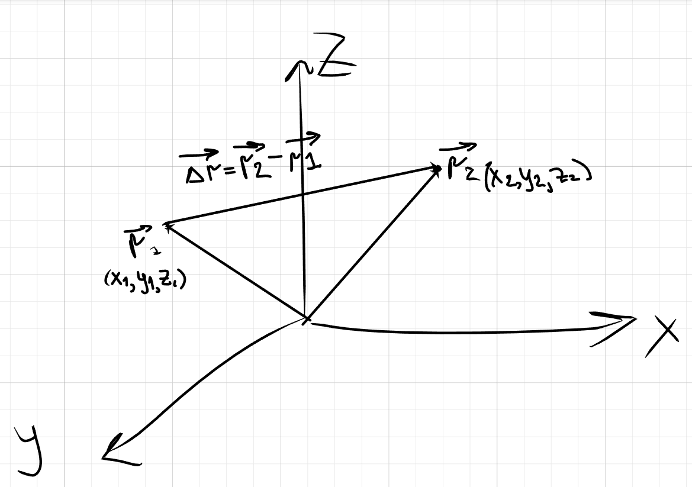

## Перемещение
**ОПР**
  
**Радиус-вектор**  
$\vec{r}$
это вектор, который задаёт положение материальной точки в пространстве относительно выбранного начала координат

**ОПР** 

$\textbf{Перемещением точки } \text{в пространстве из положения, задаваемого радиус вектором }$ 
$\vec{r_1}$ $\text{ в точку }$ $\vec{r_2}$ $\text{называется вектор }$ $\Delta r \ = \vec{r_2} - \vec{r_1}$

  
## Скорость

**ОПР**
$$
\text{\textbf{Скорость} можно вычислить по формуле } \Delta\vec{v} = \frac{\Delta\vec{r}}{\Delta t} 
$$

**Скорость** это векторная величина соноправленная с вектором перемещения

Вектор скорости можно разложить по базисным векторам, т.е
$$
\vec{v} = \frac{d\vec{r}}{dt} = \frac{dx}{dt}\vec{i} + \frac{dy}{dt}\vec{j} + \frac{dz}{dt}\vec{k}
$$

**Абсолютную величину** скорости можно найти по формуле
$$
|\vec{v}| = \frac{dS}{dt}, \text{где S - перемещение, а t - пройденное время}
$$

**Перемещение(пройденный путь)** можно вычислить по формуле
$$
S = \lim_{\Delta t_i\to0}{\sum_{i=1}^{n}v(t)dt}=\int_{t_1}^{t_2}v(t)dt
$$