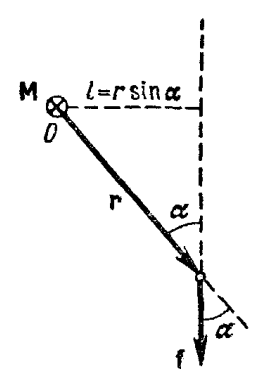
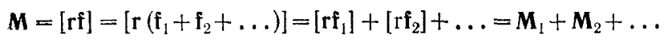
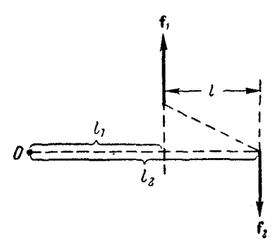
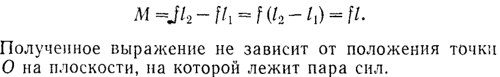
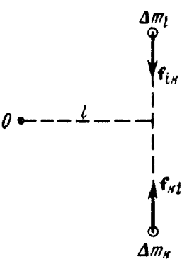

***Моментом силы f относительно точки O называется векторная велчина М, определяемая выражением:*** 
#### $M=[rf]$ - момент силы, r - радиус вектор, проведенный из точки О в точку приложения силы. 

На рисунке M перпендикулярен плоскости и направлен от нас.
М - **аксиальный вектор** (описывает вращательное движение и действует вдоль оси вращения (как штопор)) 
Описывает вращательное движение значит показывает направление вращения по **правилу правой руки**: 
* Пальцы — направление силы 
* Большой палец — направление момента
#### Простыми словами: 
**Момент силы (крутящий момент) - это "вращающая сила". Он показывает, насколько сильно сила закручивает предмет вокруг оси. (Например крутим ручку крана - создаём момент, который открывает кран)**
#### Модуль вектора $М = rfsin(\alpha)=lf$, 
где $\alpha$ - угол между направлениями векторов r и f, а **$l=rsin(\alpha)$** - ***длина перпендикуляра***, опущенного из точки О на прямую, вдоль которой действует сила. Эта длина называется ***плечом силы*** относительно точки О.

**Разложим вектор f на 2 составляющие**: коллинеарную с r составляющую ***$f_r$*** и перпендикулярную к r составляющую ***$f_\tau$***, воспользуемся дистрибутивностью векторного произведения, и тогда формула примет вид:
### $M=[rf]=[r,(f_r+f_\tau)]=[r,f_r]+[r,f_\tau]$
т.к. $f$ и $f_r$ коллинеарны, то $[r,f_r]=0$:
#### Итоговая формула момента силы относительно точки: $M=[r,f_\tau]$
Т.к. векторы $r$ и $f_\tau$ взаимно перпендикулярны:
#### Модуль вектора $М = rf_\tau$
Из дистрибутивности векторного произведения ***момент суммы сил***, имеющих общую точку приложения равен сумме моментов слагаемых сил:

### Момент пары сил
Парой сил называются 2 равные по величине **противоположно направленные** силы, не действующие вдоль одной и той же прямой. Расстояние **$l$** между прямыми - **плечо пары.**   

Момент пары сил относительно любой точки будет один и тот же.

### Суммарный момент внутренних сил

* Внутренние силы в системе  попарно равны и противоположны.
* Их моменты относительно любой точки O тоже равны по величине, но направлены в противоположные стороны.
* Поэтому **суммарный момент всех внутренних сил всегда равен нулю** (они компенсируют друг друга).