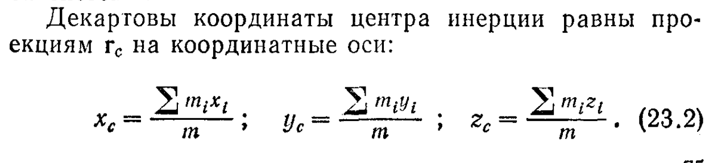
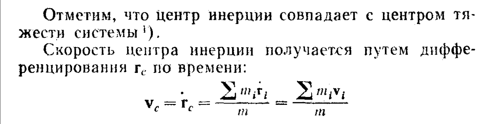
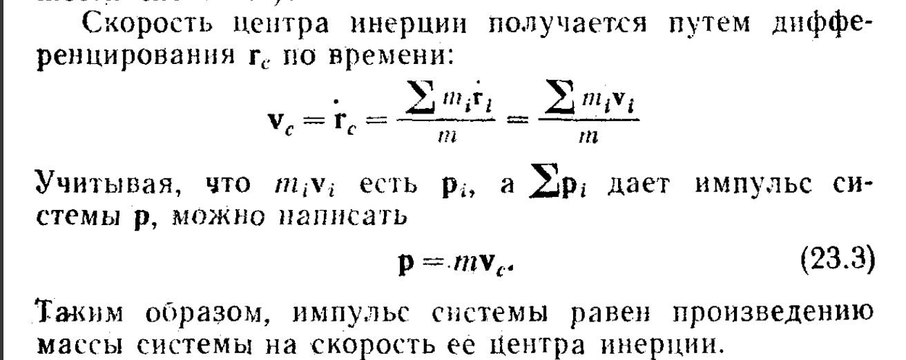
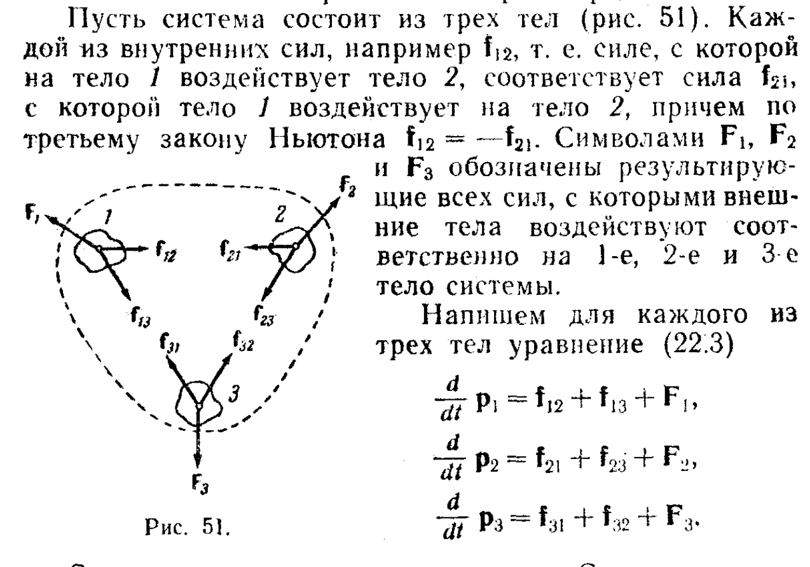
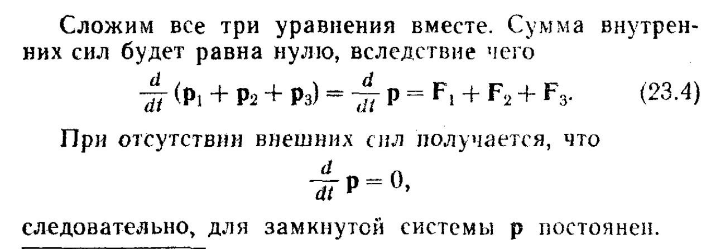
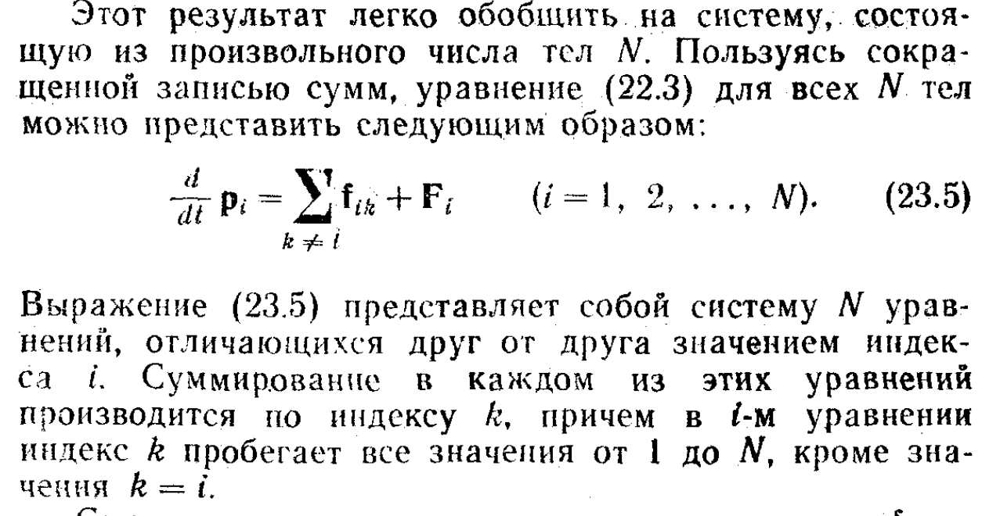
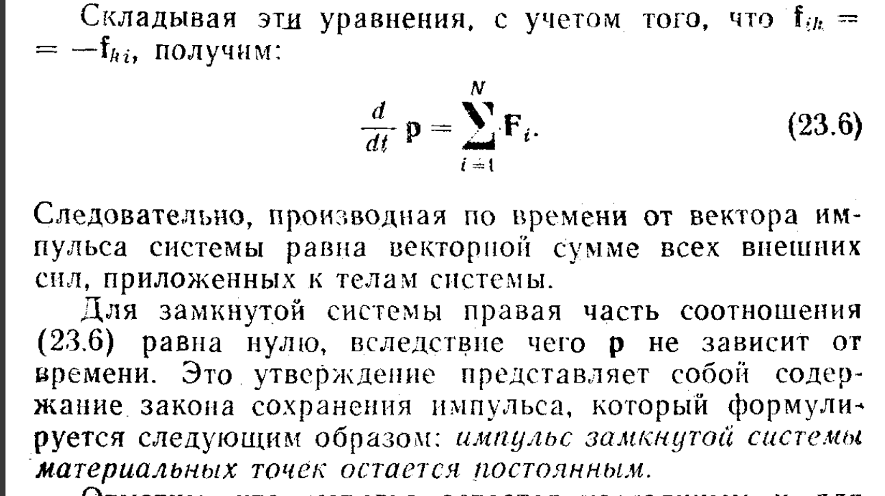

# Импульс
$$
\text{2-ой закон Ньютона: } m \frac{d\vec{v}}{dt} = \vec{F}. \text{ Т.к. } m \text{ - это константа, то её можно занести под знак дифференциала:}
$$

$$
\frac{d(m\vec{v})}{dt} = \vec{F}
$$

$$
\text{Векторная величина } \vec{p}=m\vec{v} \text{ называется \textbf{импульсом}.}
$$

$$
\text{Получается, что 2-ой закон Ньютона можно записать через импульс:}
$$

$$
\frac{d\vec{p}}{dt} = \vec{F}
$$

# Закон сохранения импульса

Рассмотрим систему из n материальных точек(тел). **Импульсом системы** p называется векторная сумма импульсов тел, образующих систему:
  
$$
p = p_1+p_2+ ... +p_N =\sum_{i=1}^{N}p_i
$$

**Центр инерции** это точка, положение которой задаётся радиус вектором 
$$
r_c \text{ где } r_c =\frac{m_1\vec{r_1} + ... +m_n\vec{r_n}}{m_1 + m_2 + ... + m_n} = \frac{\sum_{i=1}^{n} m_i \vec{r_i}}{\sum_{i=1}^{n} m_i}, где \ m_i - \text{ масса iого тела, } r_i - \text{радиус вектор}
$$

> **При отсутствии внешних сил импульс замкнутой системы постоянен**

