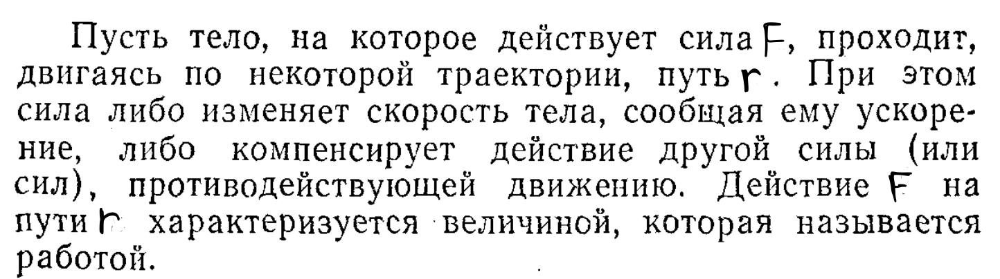
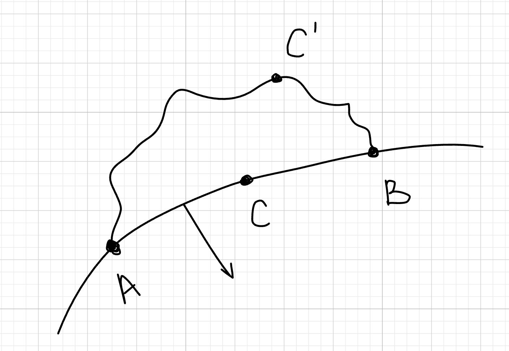

## Работа

**ОПР**

$$
A = F_{r}·r
$$

$$
где\ F_{r} - проекция\ силы\ на\ вектор\ перемещения\ \vec{r}, \ r - пройденый\ путь
$$

Когда тело движется прямолинейно и постоянная по величине сила F образует угол $\alpha$ снаправлением движения, формула имеет следущий вид:

$$
A= F_{r}·r·cos(\alpha) \ ,\ где\ \alpha - угол\ между\ \vec{F}\ и\ \vec{F}
$$

**ЗАМЕЧАНИЕ**

Можно перейти в дифференциалы:

$$
dA = F_{r}·dr
$$

$$
dA = \sum_{k=1}^{n}{F_k·dr}
$$

Отсюда можно понять, что полная работа - это сумма элементраных работ:

$$
dA = \sum_{k=1}^{n}{F_k·d(r_k)}
$$

## Потенциальное силовое поле

**ОПР**

Это область пространства, в которой на каждую материальную точку действует **сила, зависящая только от координат**, и при этом существует **скалярная функция (потенциал)**, через которую эту силу можно выразить.

Ключевое свойство: **Работа силы по замкнутому контуру равна нулю** (поле консервативно).

**ОПР**

**Консервативное поле** — это силовое поле, в котором **работа по замкнутому контуру равна нулю**, а сила зависит только от положения тела (а не от пути или скорости).

**ОПР**

$ u(x,y,z)$ - силовая функция у которой полный дифференциал $du = f_xdx + f_ydy + f_zdz$, где $ f_x = \frac{∂u}{∂x} ,\ f_y = \frac{∂u}{∂y},\ f_z = \frac{∂u}{∂z} $

**ОПР**

$ F(f_x, f_y, f_z)$-силовое поле $ ⇔$ $ F = grad(u)$

$ grad(u) = \frac{∂u}{∂x} \vec{i} + \frac{∂u}{∂y} \vec{j} + \frac{∂u}{∂z} \vec{k} $

$ dA = du$

## Работа потенциальных сил

$ A_{ACB} = \int_{ACB}f_xdx + f_ydy + f_zdz$ - криволинейный интегралл

$ A_{ACB} = \int_{ACB}du = \int_{A}^{B}du=u_B-u_A$

Работа не зависит от траектории

## Мощность

**ОПР**

Эта величина показывает, какую работу совершает тело за еденицу времени:

$$
W=\frac{dA}{dt} = \lim_{\Delta t \rightarrow 0}{\frac{\Delta A}{\Delta t}} = \frac{F_r·r }{dt}
$$

$$
где \ A -работа,\ t-время,\ F_{r} - проекция\ силы\ на\ вектор\ перемещения\ \vec{r}, \ r - пройденый\ путь
$$

**ОПР**

В векторном виде(сколярное произведенеи вектора силы на вектор скорости):

$$
W = (\vec{F}, \vec{v})
$$
