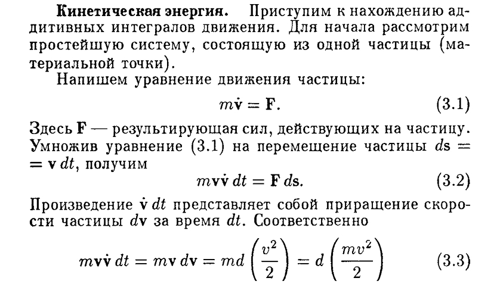
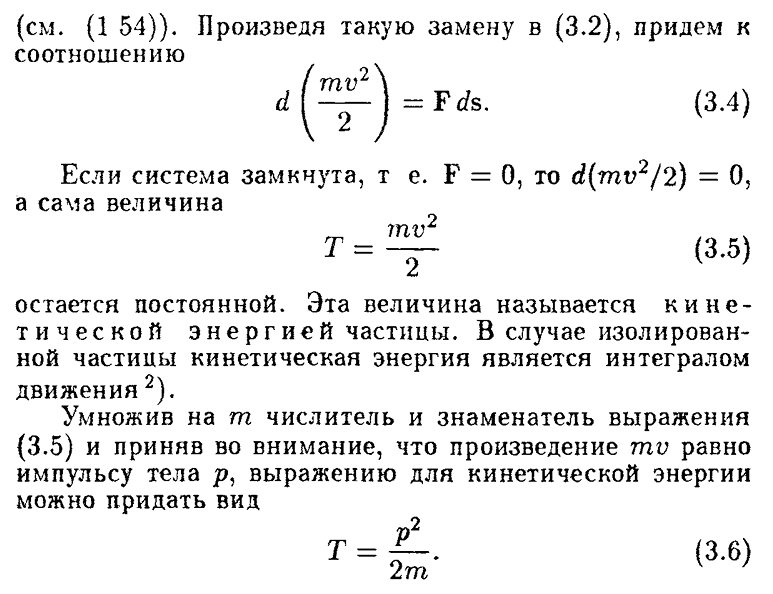

# Энергия. Кинетическая энергия. Потенциальная энергия.
## Кинетическая энергия
**Кинетическая энергия** — это энергия, которой обладают тела вследствие своего движения :).

Связь кинетической энергии и работы:

$dA = F'vdt; \ \ \ dp = mdv;$

$dA = F'vdt = mvdv = d\left(\dfrac{mv^2}{2}\right) = dT;$

$A = T_2 - T_1.$

**Консервативными** называются силы, для которых работа, совершаемая над частицей силами поля, зависит лишь от начального и конечного положений частицы и **не зависит** от пути, по которому двигалась частица.

## Потенциальная энергия
**Потенциальная энергия** — это энергия, которая определяется взаимным расположением тел (или частей того же тела) ;).

Пусть $A_{ik}$ означает работу по перемещению из i в k.

$U_0 \rightarrow U_1$ (перемещение из $U_0$ в $U_1$)

$U_1 = U_0 + A_{10}$ ($A_{10}$ означает работу по перемещению из 1 в 0)

$U_2 = U_0 + A_{20}$

$\vdots \ \ldots$

Рассмотрим $U_1 - U_2 = (U_0 + A_{10}) - (U_0 + A_{20}) = A_{10} - A_{20} = A_{10} - (-A_{02}) = A_{10} + A_{02}$

Т.к. работа по перемещению из 1 в 0 складывается с работой по перемещению из 0 в 2, то это то же самое, что и работа по перемещению из 1 в 2, т.е. $A_{12}$.

$U_1 - U_2 = A_{12}$, где $U_2$ — потенциальная энергия в точке $U_2$. 

Если рассматриваем поле силы тяжести, то:

$$U = mgh;$$

$$E = T + U = \dfrac{mv^2}{2} + mgh,$$ 

что является **полной** механической энергией системы. 