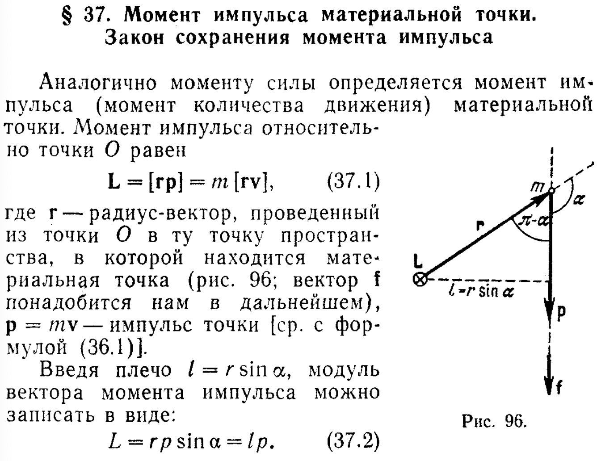
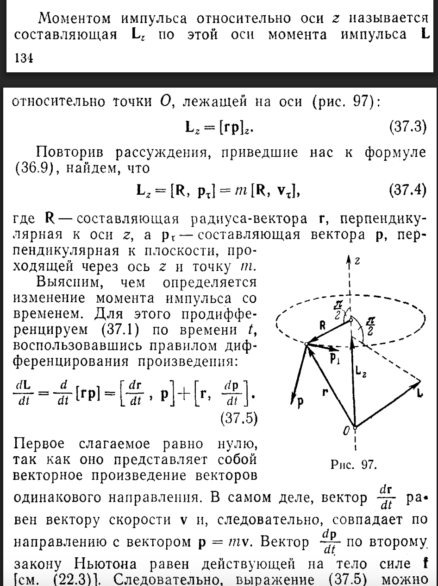
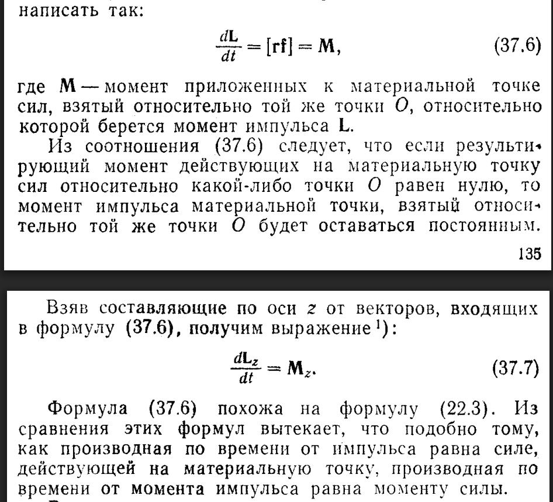
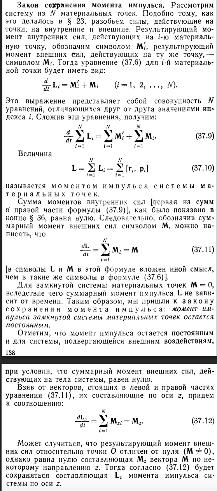
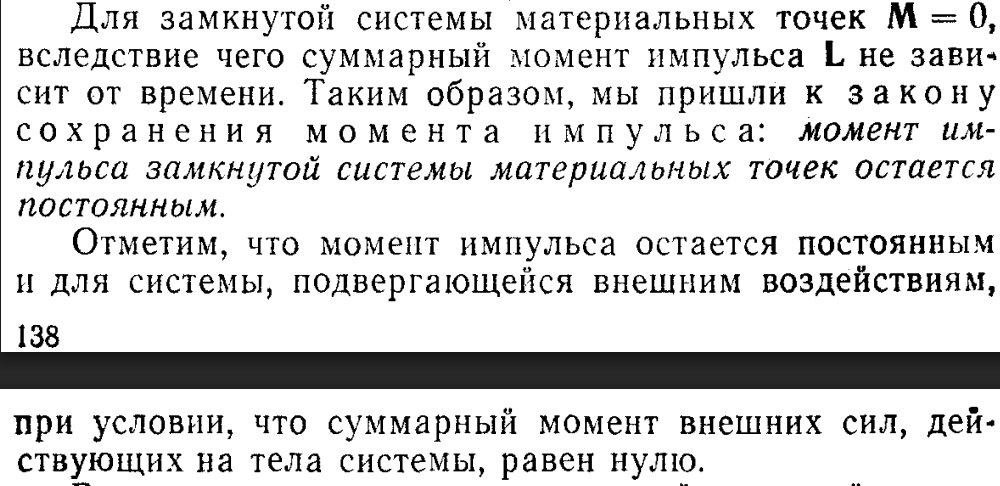
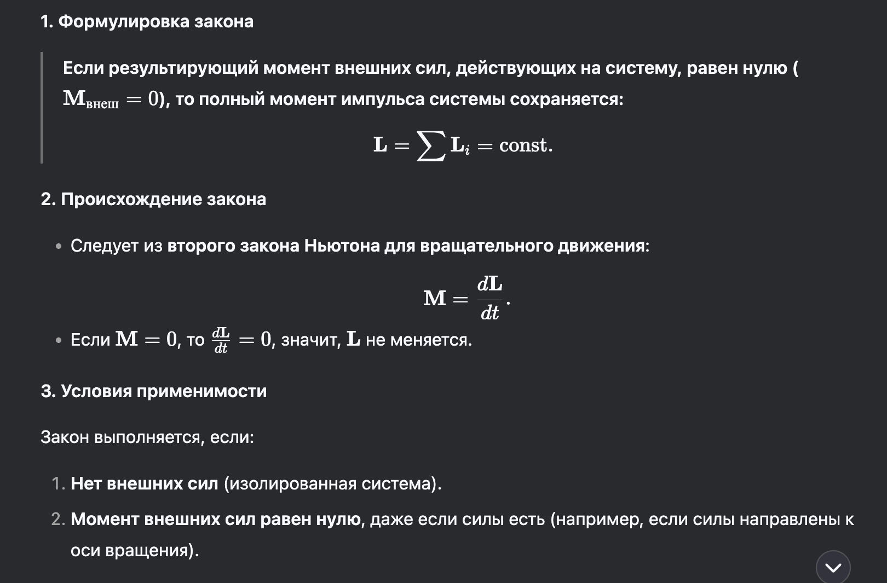

## Момент импульса

## А теперь разбираемся
### Основные формулы:

>  1) Момент импульса относительно точки О:

$$
L = [rp] = m[rv], \newline
$$ 
$$
\text{ где r - радиус-вектор, проведенный из О к материальной точке}, \newline \text{p = mv - импульс точки }
$$

> 2) Плечо l 
$$
l = r \sin{a}
$$
> 3) Модуль вектора момента импульса L
$$
L = rp \sin{a}=lp
$$ 

> 4) Lz - Момент импульса относительно оси z
$$
L_z = [rp]_z = [R, p_\tau] = m[R, v_\tau], \newline
$$
$$
\text{где R - составляющая радиус вектора r, перпендикулярная к оси z,}
\newline
$$
$$
{p_\tau} \text{ - составляющая вектора p, перпендикулярная к плоскости,}\newline
\text{проходящая через ось z и m,}
\newline 
$$
$$
{v_\tau} \text{ - компонента скорости, направленная перпендикулярно к R в плоскости,} 
\newline 
$$
$$
\text{перпендикулярной оси z (из формулы p = mv)}
$$

PS: p и v еще называют тангенциальными (перпендикулярными R) составляющими
>5) изменение момента импульса со временем t
$$
\frac{dL}{dt}=\frac{d}{dt}[rp]=[\frac{dr}{dt}, p]+[r,\frac{dp}{dt}]
$$
Но первое слагаемое равно 0, так как это векторное произведение векторов одинакового направления (вектор dr/dt совпадает с направлением вектора скорости v и следовательно вектора p = mv ). Вектор dp/dt по второму закону ньютона можно равен действующей на тело силе f, следовательно можно записать так:
$$
\frac{dL}{dt} = [rf] = M
$$

>6) момент импульса системы материальных точек

- уравнение для i-ой материальной точки:
$$
\frac{d}{dt}L_i=M'_i+M_i \space \text{ (i = 1,2...,N) }
$$
- если все сложить:
$$
\frac{d}{dt} \sum_{i=1}^N L_i=\sum_{i=1}^NM'_i+\sum_{i=1}^NM_i
$$
- получим момент импульса системы материальных точек:
$$
L=\sum_{i=1}^NL_i=\sum_{i=1}^N[r_i,p_i]
$$

>7) суммарный момент внешних сил (не то же самое что формула 5)
$$
\frac{dL}{dt}=\sum_{i=1}^NM_i=M
$$

### В чем смысл?
Определения:

### Момент импульса (или угловой момент)
> — это векторная физическая величина, характеризующая количество вращательного движения материальной точки или системы (формула 1 для материальной точки).

### Физический смысл:
>Момент импульса показывает, насколько интенсивно тело вращается вокруг некоторой точки или оси. Чем больше 
L, тем сложнее остановить вращение.

### Момент импульса относительно оси
> Если ось вращения фиксирована (например, ось z), то момент импульса относительно этой оси есть формула 4

### Закон сохранения импульса
> Если суммарный момент внешних сил M_внеш=0, то момент импульса системы сохраняется: L=const.

> 