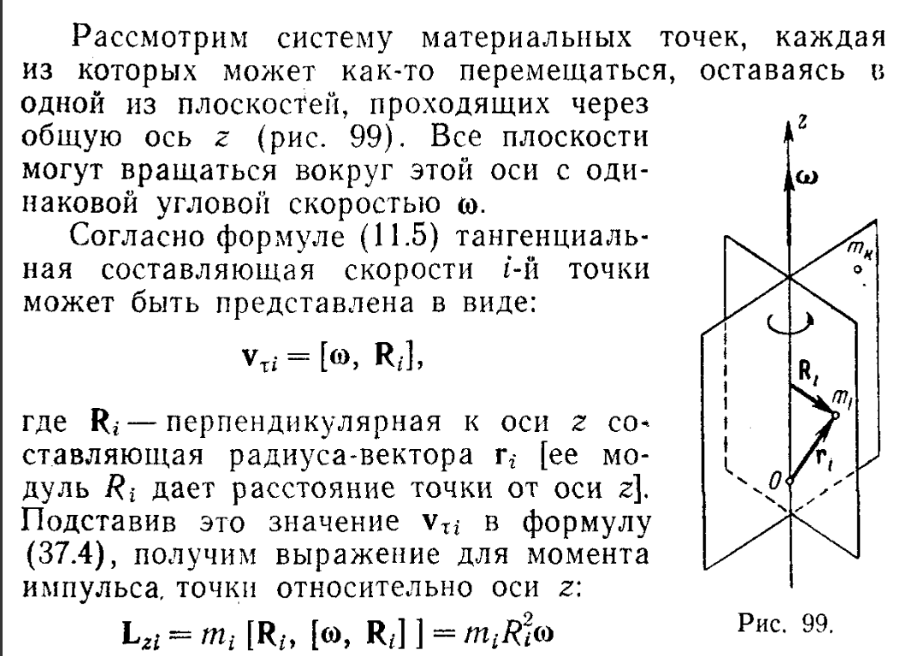
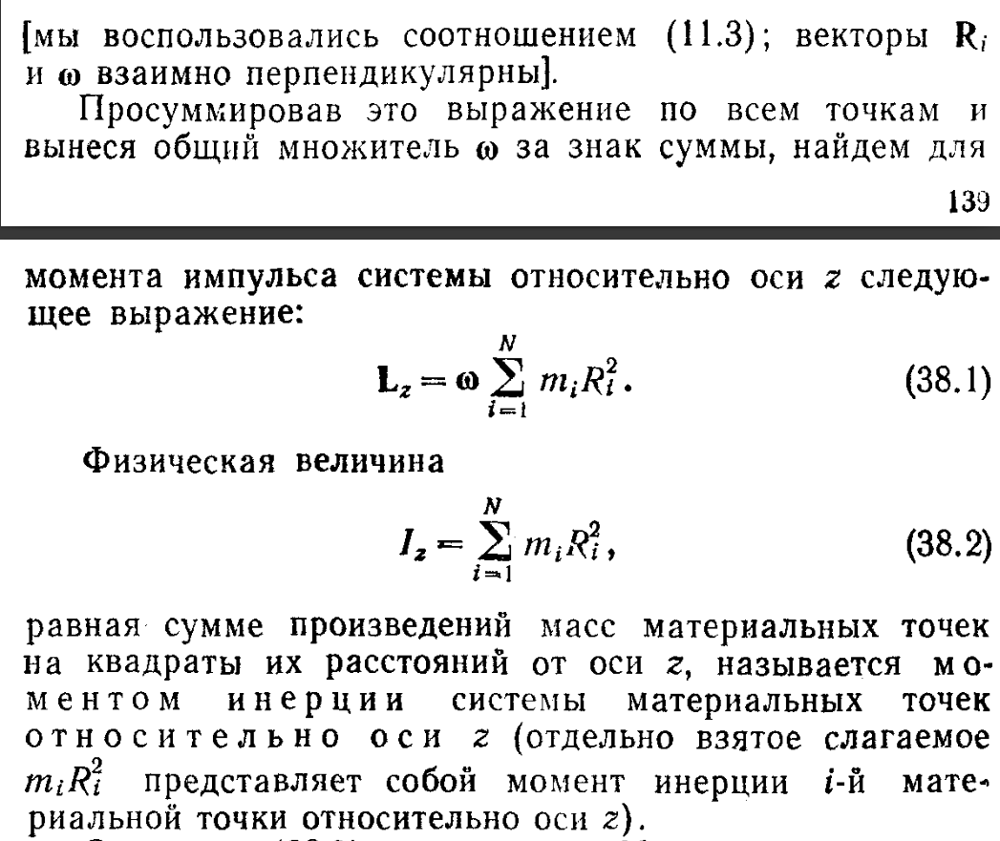
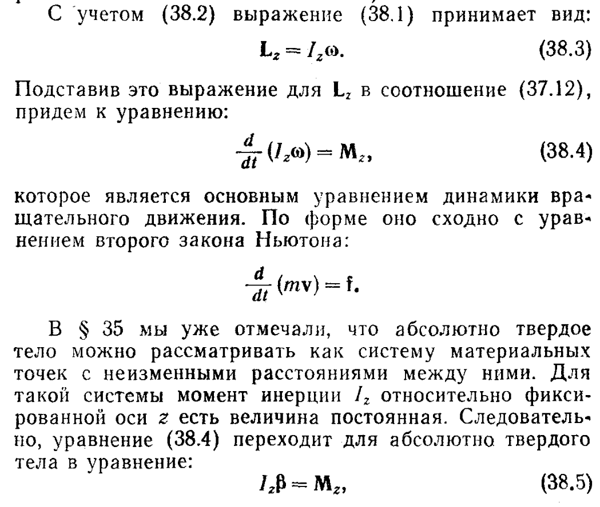
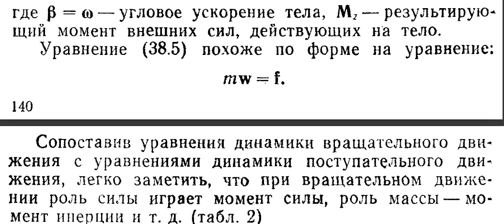
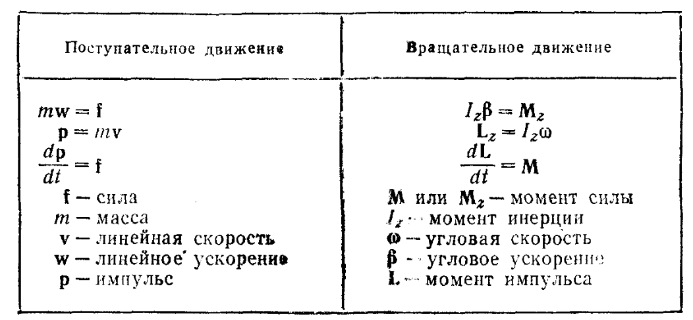
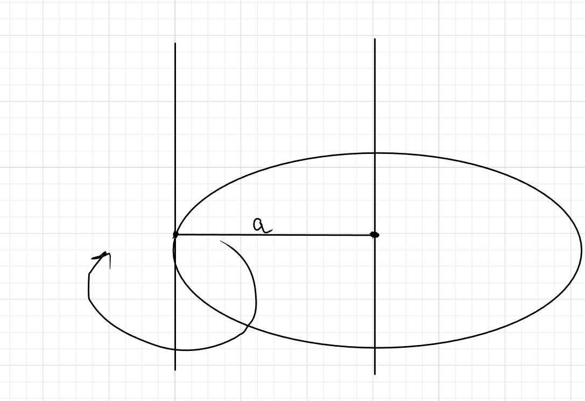
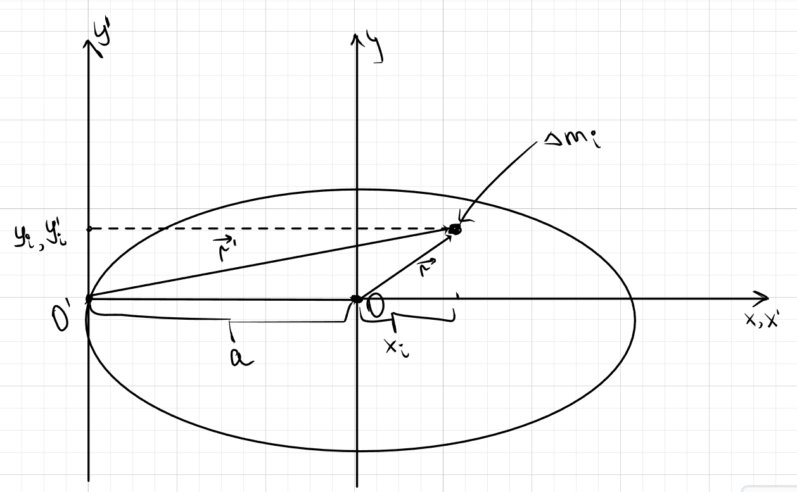

# Вращательное движение
## Про вращательное движение

## Про момент инерции

## Формула связывающая момент инерции и момент сил
$$
I_z\cdot\beta=M_z \\
где \\ I_z - момент \ инерции \ I = w\cdot\sum_{i=1}^{N}{m_i\cdot \vec{r_i}^2} \\
\beta-угловое \ ускорение \ \beta = \frac{dw}{dt}\\
M_z - момент \ cил \ M_z = \sum_{i}{F_i \cdot r_i}
$$

## Теорема Штейнера

Момент инерции тела, вращающегося вокруг произвольной оси, равен сумме моментов инерции проходящий через центр инерции и произведению массы на квадрат расстояния между осями
  
$$
I = I_0 + ma^2 \\
где \ I_0 -момент инерции в центре \\
a - расстояние \ между \ осями
$$

### Д-во теоремы Штейнера

$$
x_i' = x_i \ + \ a \\
y_i' = y_i \\
\text{по рисунку выражаем векторы } \vec{r}^2 \ и \ \vec{r'}
$$
$$
получаем \\ \vec{r_i}=x_i^2 + y_i^2 \\
\vec{r_i'}^2 = x_i'^2 + y_i'^2=(a+x_i)^2+y_i^2
$$
По опр момента инерции получаем, что 
$$
I_0 = \sum{\vec{r_i}\cdot\Delta m_i} = \sum(x_i^2 + y_i^2) \Delta m_i \\
I_0' = \sum{\vec{r_i'^2}\cdot\Delta m_i} = \sum((a+x_i)^2 + y_i^2)\Delta m_i
$$
Время расскрыть скобочки у последнего момента инерции
$$
I_0' = \sum(x_i^2+y_i^2)\Delta m_i + a^2\sum{\Delta m_i} + 2a \sum{x_i \Delta m_i}
$$

Т.к ось проходит через центр инерци, то 
$$
X_c = 0, где \ X_c = \frac{1}{m}\sum{x_i\Delta m_i} \Rightarrow \sum{x_i\Delta m_i}=0
$$

По итогу получаем, что 
$$
I_0' = I_0 + ma^2
$$
**ЧТД**