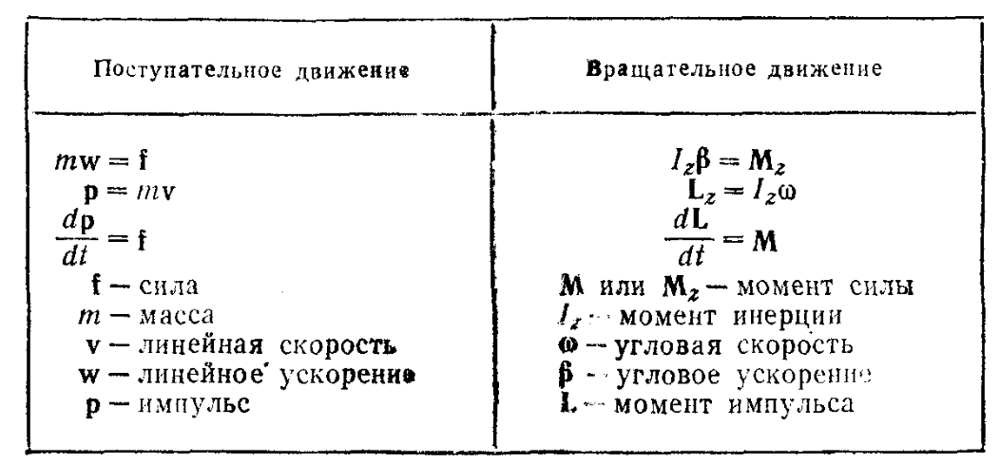
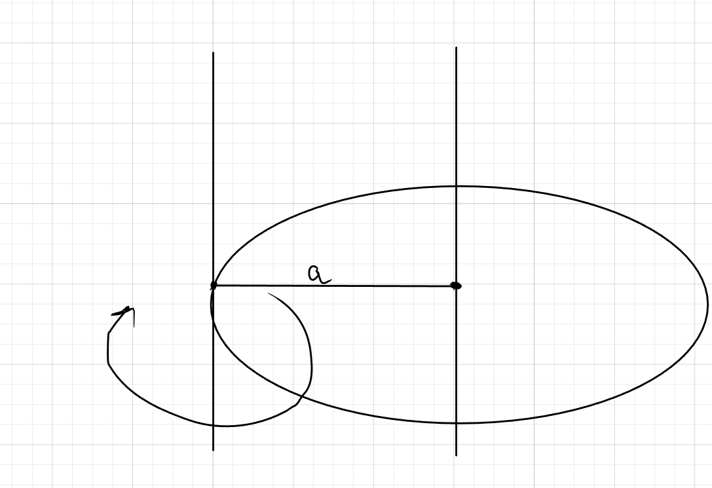
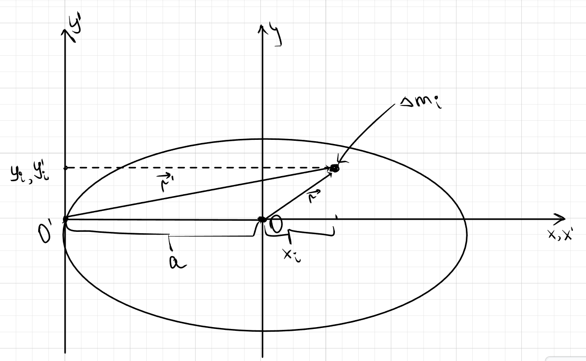

# Вращательное движение

## Основные понятия вращательного движения

## Момент инерции

## Формула связи момента инерции и момента сил

Основное уравнение динамики вращательного движения:

$$
I_z \cdot \beta = M_z
$$

где:
- $I_z$ - момент инерции относительно оси z, $I = \sum_{i=1}^{N} m_i \cdot r_i^2$
- $\beta$ - угловое ускорение, $\beta = \frac{d\omega}{dt}$
- $M_z$ - момент сил относительно оси z, $M_z = \sum_{i} F_i \cdot r_i$

## Теорема Штейнера

Момент инерции тела, вращающегося вокруг произвольной оси, равен сумме:
1. Момента инерции относительно параллельной оси, проходящей через центр масс
2. Произведения массы тела на квадрат расстояния между осями

$$
I = I_0 + m a^2
$$

где:
- $I_0$ - момент инерции относительно оси через центр масс
- $m$ - масса тела
- $a$ - расстояние между осями

### Доказательство теоремы Штейнера

Введем координаты:
$$
x_i' = x_i + a \\

y_i' = y_i
$$
Выразим радиус-векторы:
$$
\vec{r_i}^2 = x_i^2 + y_i^2 \\
\vec{r_i'}^2 = (a + x_i)^2 + y_i^2
$$
По определению моментов инерции:
$$
I_0 = \sum \vec{r_i}^2 \Delta m_i = \sum (x_i^2 + y_i^2) \Delta m_i \\
I_0' = \sum \vec{r_i'}^2 \Delta m_i = \sum [(a + x_i)^2 + y_i^2] \Delta m_i
$$
Раскроем скобки в последнем выражении:
$$
I_0' = \sum (x_i^2 + y_i^2) \Delta m_i + a^2 \sum \Delta m_i + 2a \sum x_i \Delta m_i
$$

Так как ось проходит через центр инерции:
$$
X_c = \frac{1}{m} \sum x_i \Delta m_i = 0 \Rightarrow \sum x_i \Delta m_i = 0
$$

Итоговое выражение:
$$
I_0' = I_0 + m a^2
$$

$\textbf{Что и требовалось доказать.}$