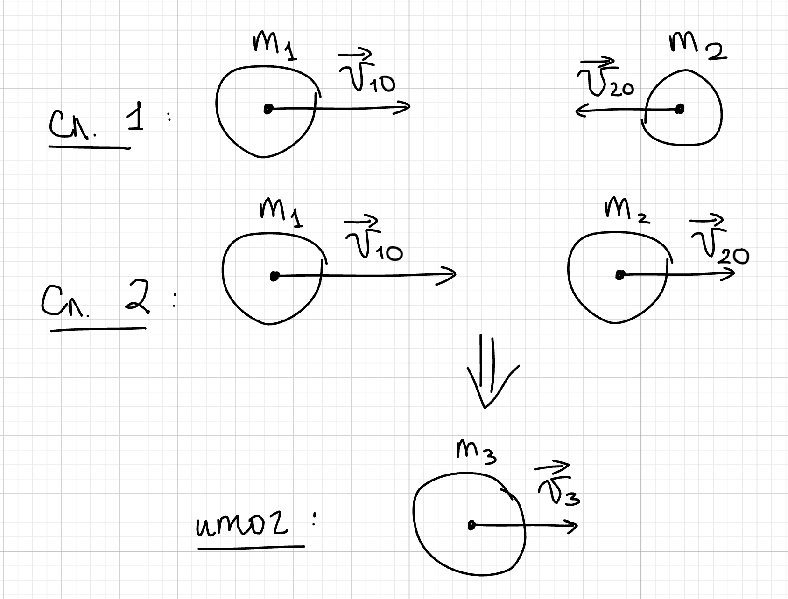
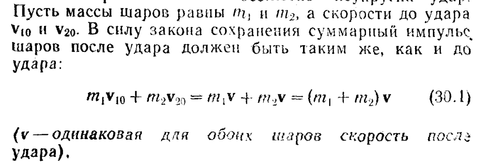
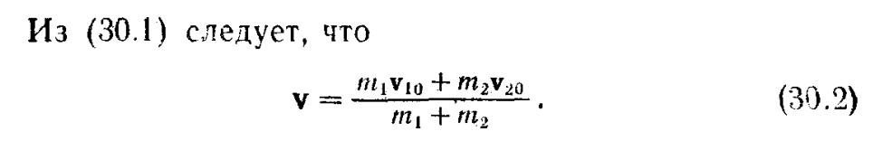
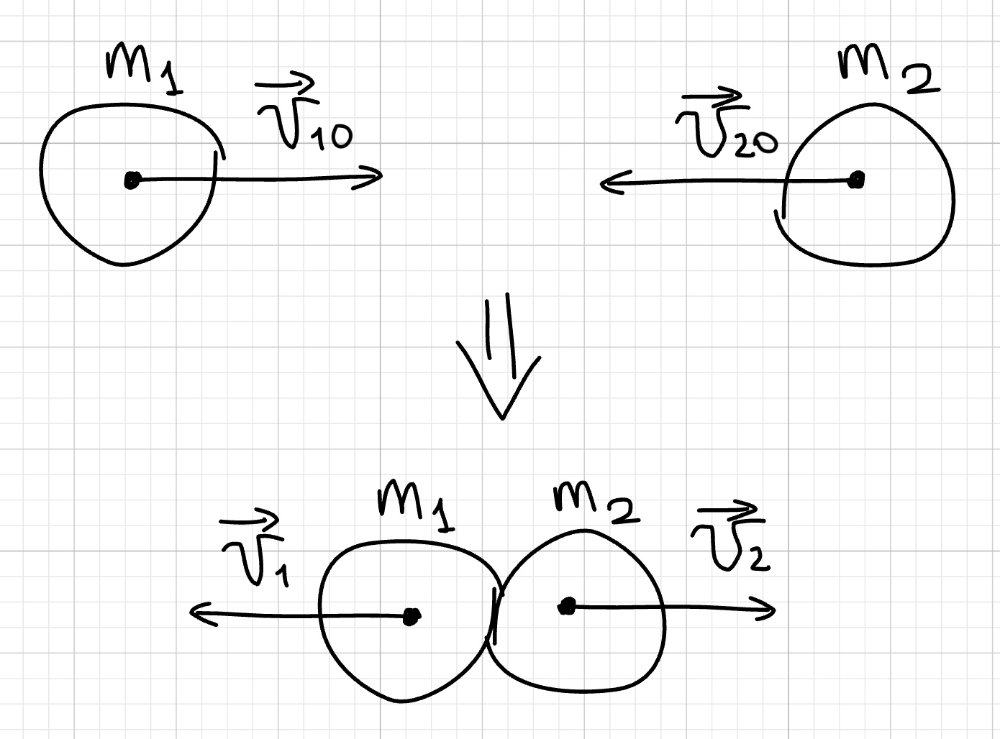
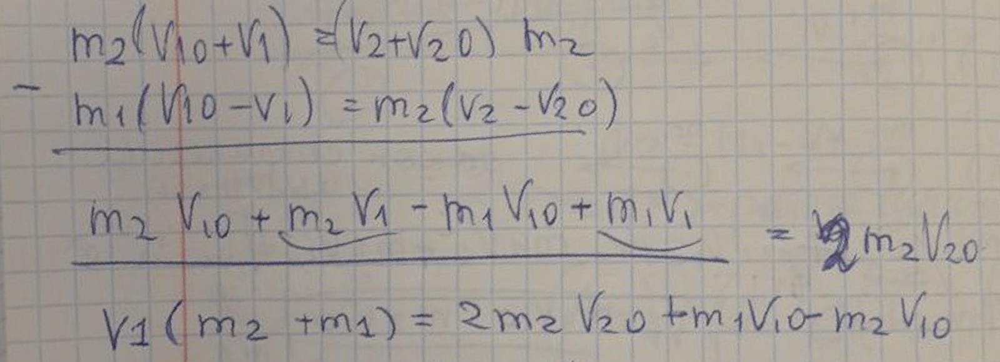

## Центральный удар двух шаров

Существует 2 вида ударов: абсолютно упругий и неупругий. Они отличаются состоянием системы после удара двух шаров(тел).

## Неупругий удар

Рассмотрим 1-ый случай, когда шары движутся навстречу друг к другу. Здесь у нас работает только закон сохранения импульса:

Теперь случай 2-ой, когда шары движутся в одном направлении, но первый шар догоняет второй:

$$
V=\frac{m_0V_{10}-m_2V_{20}}{m_1+m_2}
$$

## Неупругий удар

При таком виду удара действуют 2 закона: сохранения импульса (1) и сохранения механической энергии (2).

$$
(1):\ \ \ m_1V_{10}+m_2V_{20} = m_1V_1 +m_2V_2
$$

$$
(2):\ \ \ \frac{m_1V_{10}^2}{2} + \frac{m_2V_{20}^2}{2} = \frac{m_1V_{1}^2}{2} + \frac{m_2V_{2}^2}{2}
$$

Далее будут выкладки из системы выше, чтобы выразить скорости:

$$
(1) \Rightarrow (3):\ \ \ m_1(V_{10} - V_1) = m_2(V_2-V_{20})
$$

$$
(2) \Rightarrow (4): \ \ \ \frac{m_1}{2}(V_{10}^2-V_{1}^2)=  \frac{m_2}{2}(V_{20}^2-V_{2}^2)
$$

Распишем разность квадратов и домножим на 2 в (4):

$$
m_1(V_{10}-V_{1})(V_{10}+V_{1})=  m_2(V_{20}-V_{2})(V_{20}+V_{2})
$$

Из (3) понимаем что:

$$
(5): \ \ \ \ (V_{10}+V_{1})=  (V_{20}+V_{2})
$$

Тут делаем небольшие преобразования с формулами:

Получаем

$$
V_1 = \frac{2m_2V_{20}-V_{10}(m_2 - m_1)}{m_2+m_1}
$$

Аналогично можно получить

$$
V_2 = \frac{2m_1V_{10}+V_{20}(m_2 - m_1)}{m_2+m_1}
$$
