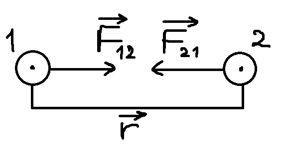
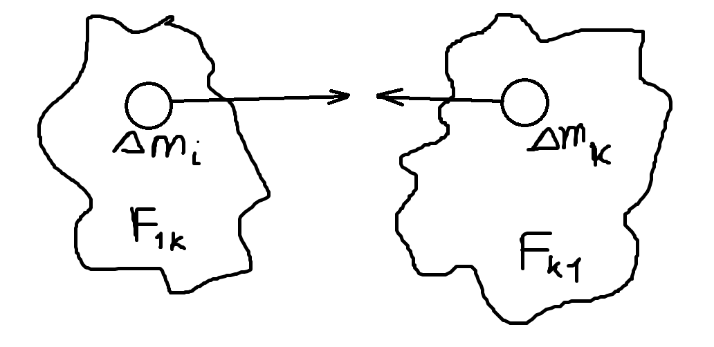

# Закон всемирного тяготения. Законы Кеплера. Космические скорости.
## Закон всемирного тяготения

$$F = \gamma \ \dfrac{m_1 m_2}{\left|\overrightarrow{r}\right|^2},$$

где $\gamma$ — гравитационная постоянная $(G)$

$$\Delta \overrightarrow{F_{1k}} = \gamma \ \dfrac{\Delta m_{i_{\Delta}} m_k}{\left|\overrightarrow{r_{ik}}\right|^2} \  \overrightarrow{r_{ik}},$$

где $\overrightarrow{r_{ik}}$ — единичный вектор, определяющий направление

$$F_{12} = \sum\limits_i \sum\limits_k \gamma \ \dfrac{\Delta m_i \Delta m_k}{\left|\overrightarrow{r_{ik}}\right|^2} \ \overrightarrow{r_{ik}}$$

$$F_{12} = -F_{21}; \ \ \ F = \gamma \ \dfrac{m_1 m_2}{\left|r\right|^2} \ \overrightarrow{r_{12}}$$

## Законы Кеплера
$\fbox{1}$ Все планеты движутся по эллипсу. Солнце в фокусе одного из этих эллипсов.

$\fbox{2}$ Радиус-вектор планеты описывает равные площади за равные промежутки времени.

$\fbox{3}$ Квадраты периодов вращения планет вокруг Солнца относятся как кубы больших полуосей их орбит. 

$T$ — период обращения вокруг Солнца.

$w_{уск} = \dfrac{v^2}{r};$

$v = \dfrac{2\pi r}{T} \ \Rightarrow \ w_{уск}= \dfrac{4\pi^2r}{T^2};$

$\dfrac{F_1}{F_2} = \dfrac{m_1 w_{уск_1}}{m_2 w_{уск_2}} = \dfrac{m_1r_1T^2_2}{m_2 r_2 T^2_1};$

Из 3 закона Кеплера заменяем отношение квадратов периодов обращения отношением кубов радиусов орбит:

$\dfrac{F_1}{F_2} = \dfrac{\frac{m_1}{r_1^2}}{\frac{m_2}{r_2^2}}$, тогда из 3 закона Кеплера следует, что $F=k \,\dfrac{m}{r^2}$, где $m$ — масса планеты, $r$ — расстояние между Солнцем и планетой.

$$F = \gamma \, \dfrac{m \cdot M_c}{r^2}$$

## Космические скорости
$$\dfrac{mv^2}{R_з} = mg$$

$v_1 = \sqrt{gR_{земли}} = \sqrt{10 \cdot 6400000} = 8000$ м/с

$\dfrac{v^2}{R_з}$ — центростремительное ускорение

$$v_2 = dA = fdr = \gamma \ \dfrac{m M_з}{r^2} \ dr$$

$$A = \displaystyle\int dA = \int\limits_{R_з}^{+ \infty} \gamma \ \dfrac{m M_з}{r^2} \ dr = - \gamma \dfrac{m M_з}{r} \bigg|_{R_з}^{+ \infty} = \gamma \ \dfrac{m M_з}{R_з} = A$$

Если $\ mg = \gamma \ \dfrac{m M_з}{R^2_з} \ \Rightarrow \ mgR_з = \gamma \ \dfrac{m M_з}{R_з}$

$A = mgR_з = \dfrac{mv^2}{2} \ \Rightarrow \ v_2 = \sqrt{2gR_з} = \sqrt{2 \cdot 10 \cdot 6400000} \approx 11$ км/с