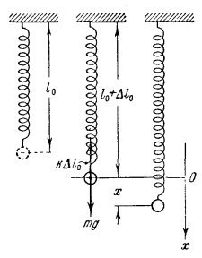
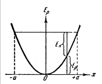
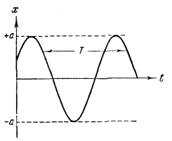

## Гармонические колебания.

В состояние равновесия сила mg уравновешивается упругой силой:
\[
mg = k\Delta l
\]

Если сместить шарик от положения равновесия на расстояние x, то удлинение пружины будет \(\Delta l+x\) и проекция результирующей силы на ось x примет значение
\[
F = mg - k(\Delta l+x)
\]
Учитывая условия равновесия:
\[
f = -kx \quad \text{- сила упругости}
\]
"-" обозначает отображает, что смещение и сила имеют противоположные направления.

В рассмотренном примере сила - упругая. Но может быть так, что сила иного происхождения обнаруживает такую же закономерность, то есть будет равна силе упругости. Сила такого вида называется - *квазиупругими*.

Для того, чтобы сообщить системе о смещение x, нужно совершить против квазиупругой силы работу:
\[
A = \int_0^x (-f)dx = \int_0^x kx\,dx = \frac{kx^2}{2}
\]

Эта работа идет на создание запаса потенциальной энергии:
\[
E_p = \frac{kx^2}{2}
\]

Обратимся к системе, изображенной на рисунке:

Сообщим шарику смещение \(x = a\). Под действием силы \(f = -kx\) шарик будет двигаться к положению равновесия со всевозрастающей скоростью \(v = \dot{x}\). При этом потенциальная энергия убывает, а кинетически энергия всевозрастающая 
\[
E_k = \frac{m\dot{x}^2}{2}
\]
Если нет трения то \(x \in [-a; a]\)

2-ой Закон Ньютона:
\[
m\ddot{x} = -kx, \quad \text{где} \quad \ddot{x} = a = \frac{d^2x}{dt^2}
\]
\[
\ddot{x} + \frac{k}{m}x = 0, \quad \frac{k}{m} = \omega_0^2 > 0
\]
\[
\ddot{x} + \omega_0^2 x = 0 \quad \text{- линейное однородное дифференциальное уравнение 2го порядка.}
\]
\[
x = a \cos(\omega_0 t + \alpha)
\]

\[
\omega_0(t + T) + \alpha = \omega_0 t + \alpha + 2\pi
\]

\[
T = \frac{2\pi}{\omega_0} \quad \text{- Период колебаний}
\]

\[
\nu = \frac{1}{T} \quad \text{- Частота колебаний}
\]

\[
\omega_0 = \frac{2\pi}{T} = 2\pi\nu \quad \text{- циклическая частота}
\]

\[
v = \dot{x} = -a\omega_0\sin(\omega_0 t + \alpha) = a\omega_0\cos\left(\omega_0 t + \alpha + \frac{\pi}{2}\right) \quad \text{(выражение скорости)}
\]

\[
a\omega_0 \quad \text{- Амплитуда колебаний скорости}
\]

\[
a_{\text{уск}} = \ddot{x} = -a\omega_0^2\cos(\omega_0 t + \alpha) = a\omega_0^2\cos(\omega_0 t + \alpha + \pi)
\]

\[
a\omega_0^2 \quad \text{- ускорение}
\]
## Энергия Гармонических Колебаний.

Квазиупругая сила является консервативной, поэтому *полная энергия гармонических колебаний* - постоянна. 

\[
E_{pmax} = \frac{a^2 \cdot k}{2} ; \quad E_{kmax} = \frac{mV_{max}^2}{2} = \frac{ma^2\omega_0^2}{2};
\]
\[
V_{max} = a\omega_0, \text{ где } \omega_0 \text{ - частота.}
\]

При максимальном отклонении:
\[
E_{полн} = E_{pmax}
\]

При прохождении положения равновесия:
\[
E_{полн} = E_{kmax}
\]

Как изменяется со временем кинетическая и потенциальная энергии:

Кинетическая энергия:
\[
E_k = \frac{m\dot{x}^2}{2} = \frac{ma^2\omega_0^2}{2} \cdot \sin^2(\omega_0 t + \alpha)
\]

Потенциальная энергия:
\[
E_p = \frac{kx^2}{2} = \frac{ka^2}{2} \cdot \cos^2(\omega_0 t + \alpha)
\]

Тогда полная энергия:
\[
E = E_k + E_p = \frac{ka^2}{2} = \frac{ma^2\omega_0^2}{2}
\]

Используя формулы тригонометрии можно придать другой вид Ek и Ep:
\[
E_k = E \cdot \sin^2(\omega_0 t + \alpha) = E \cdot \left[\frac{1}{2} - \frac{1}{2} \cos[2(\omega_0 t + \alpha)]\right]
\]
\[
E_p = E \cdot \left[\frac{1}{2} + \frac{1}{2} \sin[2(\omega_0 t + \alpha)]\right]
\]

