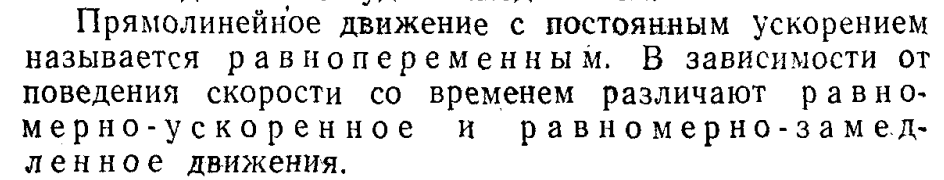

## Перемещение

**ОПР**

**Радиус-вектор**

$$
\vec{r}
$$

— это вектор, который задаёт положение материальной точки в пространстве относительно выбранного начала координат.

**ОПР**

**Прямолинейное движение** — движение материальной точки по траектории, имеющей форму прямой линии.

**ОПР**

$$
\text{\textbf{Скорость} можно вычислить по формуле } \Delta\vec{v} = \frac{\Delta\vec{r}}{\Delta t}
$$

**Скорость** это векторная величина соноправленная с вектором перемещения

## Cредняя и мгновенная скорости

**Перемещение(пройденный путь)** можно вычислить по формуле

$$
S = \lim_{\Delta t_i\to0}{\sum_{i=1}^{n}v(t)dt}=\int_{t_1}^{t_2}v(t)dt
$$

**Среднюю скорость** пути:

$$
<\vec{v}> = \frac{\Delta S}{\Delta t}
$$

**Среднюю скорость** можно вычислить по формуле

$$
<\vec{v}> = \frac{\Delta \vec{r}}{\Delta t} \ \ \ \ \ \ , \ где <\vec{v}> имеет\ напрвление\  \Delta\vec{r}
$$

**Мгновенная скорость** при Δt -> 0

$$
\vec{v} = \lim_{\Delta t\rightarrow0}{\frac{\Delta \vec{r}}{\Delta t}} = \frac{d\vec{r}}{d t}
$$

# Ускорение

**Ускорение** определяется так

$$
\vec{a} = \lim_{\Delta t \rightarrow0}{\frac{\Delta\vec{V}}{\Delta t}} = \frac{d\vec{V}}{d t} \ \ \ , \ \ где\ \vec{V} \ - вектор\ скорости
$$

**Постоянное знаечние** ускорения выглядит так

$$
|\ \vec{a}\ | = \sqrt{a_x^2 + a_y^2 + a_z^2}
$$

где проекции на оси вычисляются так

$$
a_x = \frac{dV_x}{dt} = \frac{d^2x}{dt^2} \ \ \ (анологично\ для\ y,z)
$$

**Мгновенное ускорение** определяется так

$$
<\vec{a}> = \frac{\Delta \vec{V}}{\Delta t}
$$

## Виды прямолинейного движения

### 1. Равномерное движение (`a = 0`):

* Скорость постоянна:
  $$
  v=const
  $$
* Уравнение движения:
  $$
  x(t)=x_0+v⋅t
  $$

### 2. Равнопеременное движение (`a = const`):

* Уравнение скорости:

  $$
  v(t)=v_0+a⋅t
  $$
* Уравнение движения:

  $$
  x(t)=x_0+v_0⋅t+\frac{a⋅t^2}{2}
  $$

