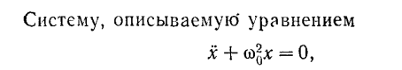
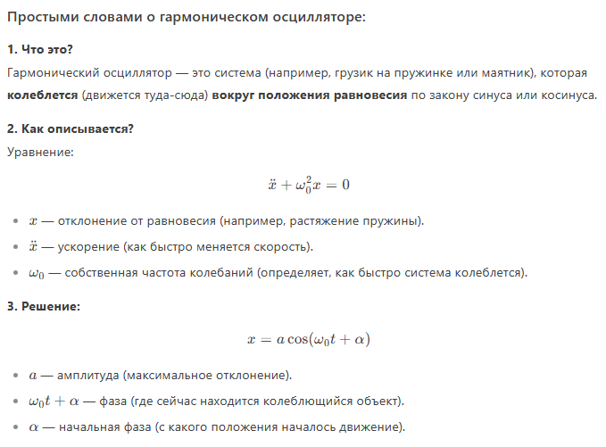
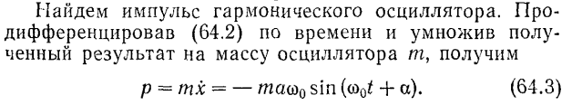
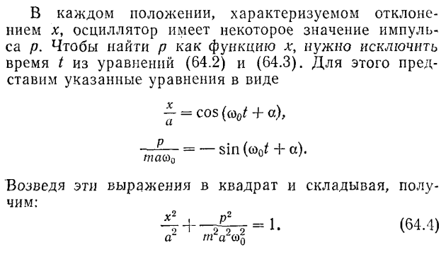
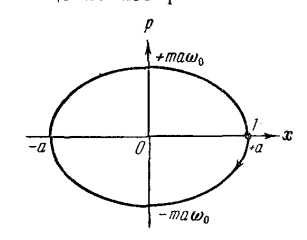
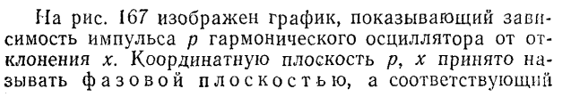
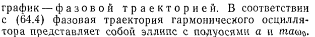
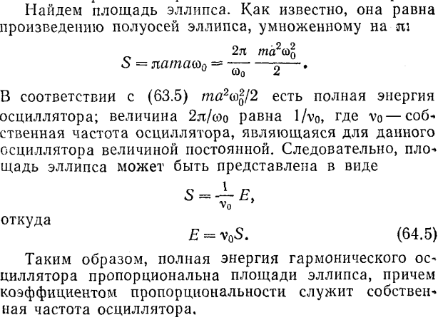
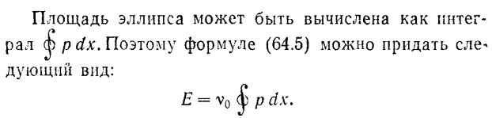

##### где $w^2_0$ постоянная положительная величина, называют гармоническим осциллятором.
Решение этого уравнения имеет вид:
#### $x=a\cos(w_0t+\alpha)$ (64.2)
**Следовательно гармонический осциллятор представляет собой систему, которая совершает гармонические колебания около положения равновесия.**

