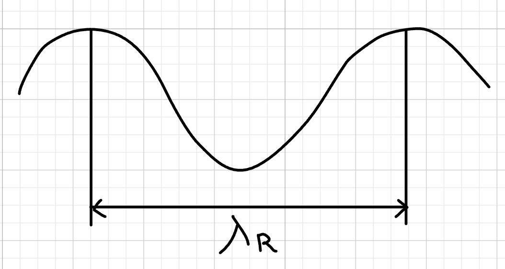
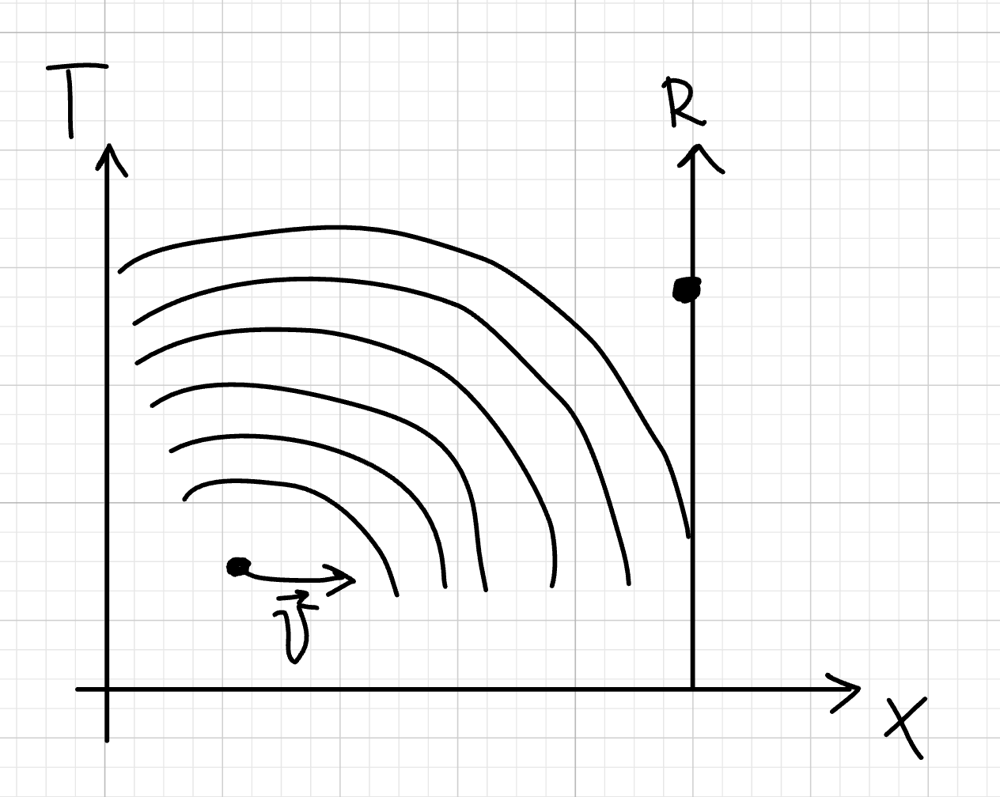
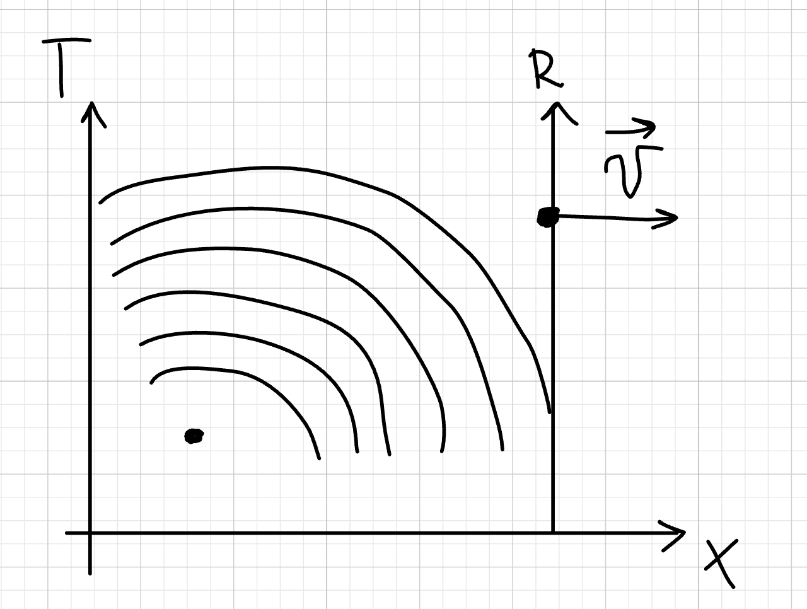
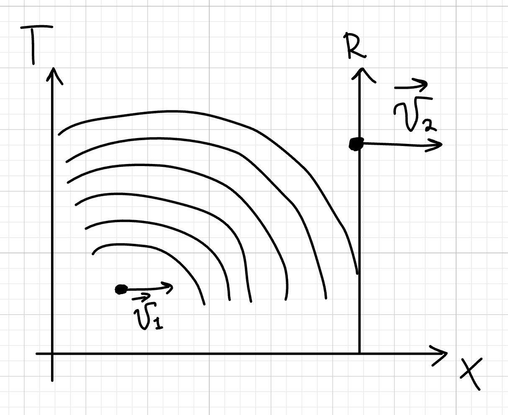
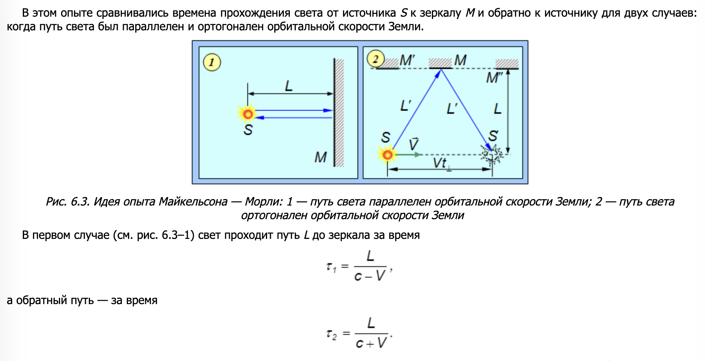
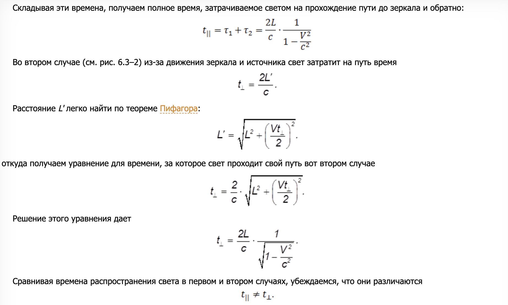
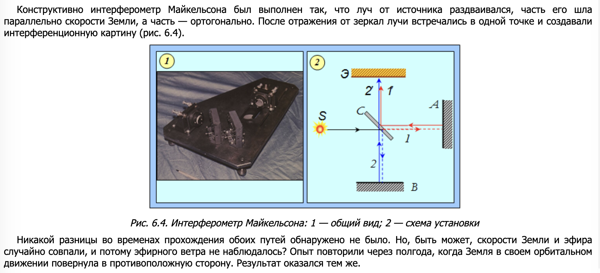

## Эффект Доплера

**Эффект Доплера** — это изменение **частоты** и **длины волны** сигнала (звука, света, радиоволн) из-за движения источника волн или наблюдателя.

* Если **источник** и **наблюдатель** **сближаются** → частота **увеличивается** (длина волны уменьшается).
* Если **удаляются** → частота **уменьшается** (длина волны увеличивается).

Мы будем рассматривать данный эффект на примере звуковых волн в некой среде распространяющей данный тип волн.

**ОПР**

Длинна волны - это растояние между двумя ближайшими точками, колеблющимися в одинаковой фазе. Обозначать будем $ \lambda_R$

**ОПР**

Частота - это количество колебаний в секунду (Гц). Обозначать будем $ \nu_R=\frac{N}{t}$ (t-время, N-количество волн за промежуток t)

**ОПР**

Скорость звука вычисляется так:

$$
V_{зв} = \lambda_R·\nu_R
$$

## Случай 1. Источник двигается, приемник в покое

$ T$ - система источника волн (например звуковых), $ \vec{u} $ - вектор скорости источника, $ R$ - система приемника волн (в состоянии покоя)

**Так как источник двигается со скоростью $ V$ , а приемник в покое** длинна волны будет вычисляться вот так:

$$
\lambda_R = \frac{t(V_{зв}-V)}{N}
$$

$$
где\ t-еденица\ времени,\ N-количество\ волн\ за\ промежуток\ времени\ t
$$

$$
\nu_R= \frac{V_{зв}}{\lambda_R} = \frac{N·V_{зв}}{t(V_{зв} - V)} = [т.к.\ \nu_T = \frac{N}{t}]= \nu_T\ ·\ \frac{V_{зв}}{V_{зв} - V}
$$

Получаем соотношение, где $\nu_R$ - частота приемника, а $\nu_T$ - частота источника:

$$
\nu_R=  \nu_T\ ·\ \frac{V_{зв}}{V_{зв} - V}
$$

## Случай 2. Источник в покое, приемник двигается

$ T$ - система источника волн (в покое), $ \vec{u} $ - вектор скорости приемника, $ R$ - система приемника волн (в движении)

$$
\nu_R= \frac{V +V_{зв}}{\lambda_{T}} =[\lambda_{T} =\frac{V_{зв}}{\nu_T}]= \frac{\nu_T (V +V_{зв})}{V_{зв}} = \nu_T (1 +\frac{V }{V_{зв}})
$$

где $\nu_R$ - частота приемника, а $\nu_T$ - частота источника, V-скорость перемещения приемника

## Случай 3. Оба двигаются

Получаем соотношение:

$$
\nu_R= \nu_T(\frac{V_{зв} +V_1}{V_{зв}-V_2})
$$

## Опыт Майкельсона — Морли

**Цель эксперимента**

Проверить существование **«эфира»** — гипотетической среды, в которой, как считалось, распространяются световые волны (аналогично звуку в воздухе). Если эфир есть, то скорость Земли относительно него должна влиять на скорость света.

Если бы эфир существовал:

* Лучи, движущиеся вдоль "эфирного ветра", должны были бы иметь разную скорость
* Это вызвало бы заметное смещение интерференционных полос при повороте прибора

Но эксперимент показал:

* Интерференционные полосы **не смещались** при повороте
* Разница во времени прохождения лучей была незначительной

## Теория данного опыта

