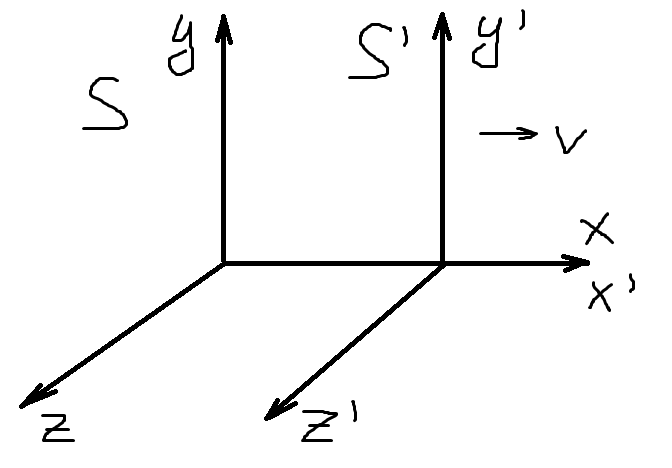

# Преобразование Лоренца

$x^2 + y^2 + z^2 = c^2 t^2;$

$x'^2 + y'^2 + z'^2 = c^2 t'^2;$

$x' = x - vt; \ \ y' = y; \ \ z' = z; \ \ t' = t$ (преобразования Галилея)

$x^2 - 2xvt + v^2 t^2 + y^2 + z^2 = c^2 t^2;$

$x' = x - vt; \ \ y' = y; \ \ z' = z; \ \ t' = t + fx;$

$x^2 - 2xvt + v^2 t^2 + y^2 + z^2 = c^2 t^2 + 2c^2 ftx + c^2 f^2 x^2$

Если $f = \dfrac{-v^2}{c^2}$ или $t' = \sqrt{\dfrac{-vx^2}{c^2}}$

$x^2\left(1 - \dfrac{v^2}{c^2}\right) + y^2 + z^2 = c^2 t^2 \left(1 - \dfrac{v^2}{c^2}\right)$

$x' = \dfrac{x - vt}{\left(1- \frac{v^2}{c^2}\right)^{\frac12}}; \ \ t' = \dfrac{t - \frac{v}{c^2} x}{\left(1 - \frac{v^2}{c^2}\right)^{\frac12}}; \ \ y' = y; \ \ z' = z$ (преобразования Лоренца)

Если $\dfrac{v}{c} \rightarrow 0$, то преобразования Галилея.

$\beta = \dfrac{v}{c}, \ \ \ \gamma = \dfrac{1}{(1 - \frac{v^2}{c^2})^{\frac12}} = \dfrac{1}{(1 - \beta^2)^{\frac12}}$

Обратные преобразования Лоренца:

$x = \dfrac{x' + vt'}{(1 - \frac{v^2}{c^2})^{\frac12}}; \ \ \ t = \dfrac{t' + vx'^2}{(1 - \frac{v^2}{c^2})^{\frac12}}; \ \ y = y'; \ \ z = z'$