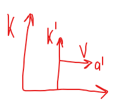
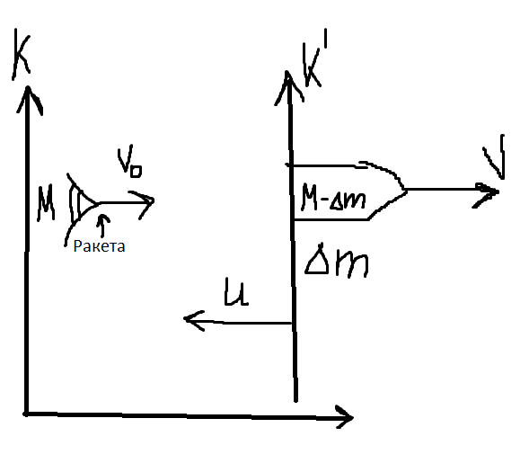

##### Релятивистское уравнение движения
**Релятивистское движение** — это движение тел со скоростями, сравнимыми со скоростью света (v∼c). В этом режиме классическая механика Ньютона неприменима.

Ракета летит из состояния покоя с ускорением $a'$
K - система, связанная с неподвижным наблюдателем (например, с Землёй или условной "неподвижной" точкой в пространстве).
K' - система связанная с ускоряющейся ракетой или движущимся объектом, меняется при ускорении.
$\Delta V=(1-\frac{v^2}{c^2})\Delta v'$
$Δv'$  — изменение скорости в K'
$ΔV$ — соответствующее изменение в K
Множитель ($1-\frac{v^2}{c^2}$) — релятивистский эффект замедления изменений при v→c. (c - скорость света)
$a'=\frac{dv'}{dt'}$ - ускорение ракеты.

### $[\text{Выразим } \Delta v':  \Delta v'=a\Delta t] \frac{\Delta V}{1-\frac{v^2}{c^2}}=\frac{dv'}{dt'}\Delta t'=a' \Delta t'$ (*)
[Это уравнение описывает, как ускорение ракеты в её собственной системе отсчёта (K') проявляется в лабораторной системе (K) при релятивистских скоростях.]
##### $c^2 \int^v_0 \frac{dv}{c^2-v^2}=a' \int_0^{t'} dt$ - релятивистское ускорение, получается из релятивистского аналога второго закона Ньютона

##### $V_г=\frac{v-u}{(1-\frac{vu}{c^2})}$  - релятивистское сложение скоростей (показывает, как преобразуются скорости при переходе между системами отсчёта), частный случай преобразования скоростей Лоренца.
Решая интегралы получим: $\ c \ arth(\frac{v}{c})=a't' \ \ \text{ Продолжаем: }\frac{v}{c}=th \frac{a't'}{c}$
$x=\int vdt=\int^{t'}_0v\frac{dt'}{(1-\frac{v^2}{c^2})^{\frac{1}{2}}} $ - преобразования Лоренца

Выведем из **(*)** $dt'=\frac{1}{a'}\frac{c^2dv}{c^2-v^2}$

#### $x=\frac{c^3}{a'}\int^v_0\frac{vdv}{(c^2-v^2)^{\frac{3}{2}}}=\frac{c^3}{a'}[\frac{1}{(c^2-v^2)^\frac{1}{2}}-\frac{1}{c}]$ - релятивистское уравнение движения для ракеты с постоянным собственным ускорением $a'$
(Это уравнение описывает траекторию ракеты в $К$)

**Делаем систему отсчёта относительно движущейся ракеты.**
$u$ - скорость топлива относительно ракеты в $K'$
M — начальная масса ракеты (включая топливо)
$Δm$ — небольшая порция топлива, которая выбрасывается из ракеты за малый промежуток времени. В системе $K′$ эта масса покидает ракету со скоростью $u$.
$M−Δm$ — масса ракеты после выброса топлива $Δm$.

$V_1$ - скорость выброшенного топлива в системе $K$
$V_0$ - начальная скорость ракеты в K
$V$ — скорость ракеты после выброса $Δm$ в $K$
$P_T=\Delta m V_1$ - импульс выброшенного топлива
$V_1=u+V$
$P_0=MV_0=(M-\Delta m) V + P_T = (M-\Delta m)V+\Delta m (u+V)$
$MV_0=(M-\Delta m)V+\Delta m (u+V)$ - закон сохранения импульса
$M(V_0-V)-\Delta m u=0$ - раскрыли скобки
$V-V_o=\Delta V$
$M\Delta V+\Delta m u = 0, [\Delta m = \mu\Delta t]\ \  \mu$ - кф сгорания топлива
$M\Delta V + \mu \Delta t u = 0 | * \frac{1}{\Delta t}$
$Ma + \mu u = 0$
$-\mu u = F_г => F_г  =Ma$ - **сила сопротивления топлива**
#### $Ma= F_г + F_{внеш.сил}$ - Уравнение Мещерского для конкретного момента времени
Это **уравнение движения ракеты** (уравнение Мещерского), описывающее:
* как реактивная тяга $(−μu)$ разгоняет ракету,
* как внешние силы (например, гравитация) влияют на её движение.
* В случае без внешних сил ($F_{внеш}=0):Ma=−μu$ (Ракета ускоряется за счёт истечения газов)
  
$M(t)\frac{dv}{dt}=-u\frac{dm}{dt}$  **реактивная сила**
### $M(t)\frac{dv}{dt}=u_1\frac{dm_1}{dt}-u_2\frac{dm_2}{dt}+F_{внеш.сил}$ 
#### уравнение Мещерского в общем виде
[$u_1\frac{dm_1}{dt}$ - мусор от сгорания топлива, по сути можно его принять за 0]