# Про Волны

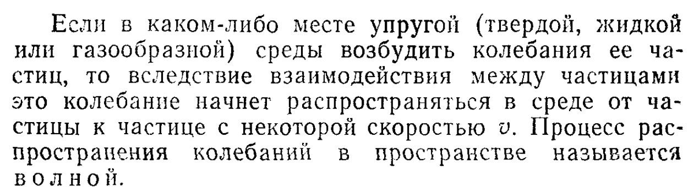

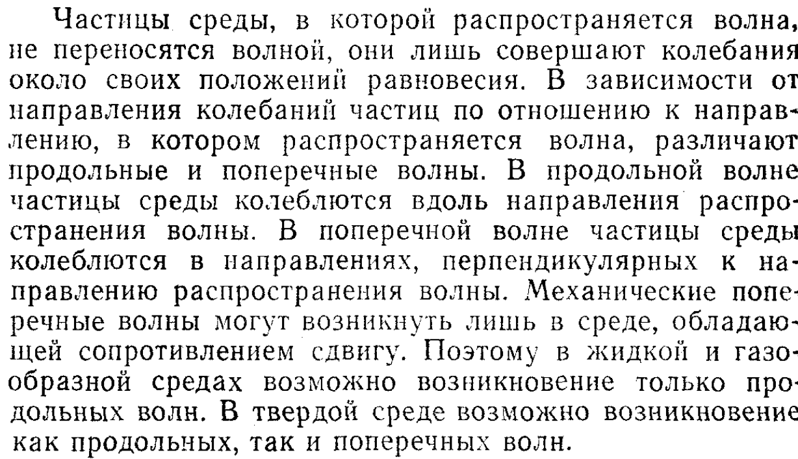

**Картинка, показывающая колебания частиц**

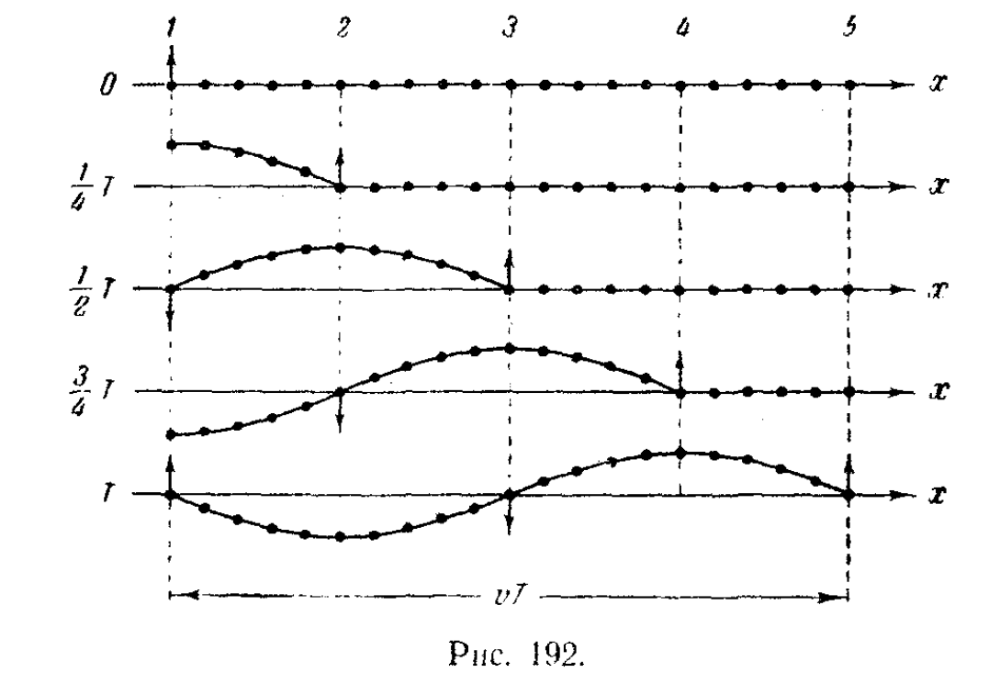

$$
\textbf{формула длины волны }\lambda = v*T
$$

$$ 
\textbf{формула периода колебаний } T = \frac{1}{\nu}
$$

$$
\lambda \cdot \nu = v
$$

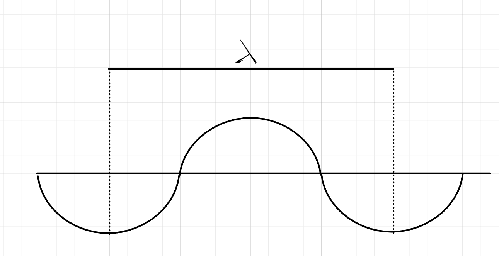

# Волновое Уравнение

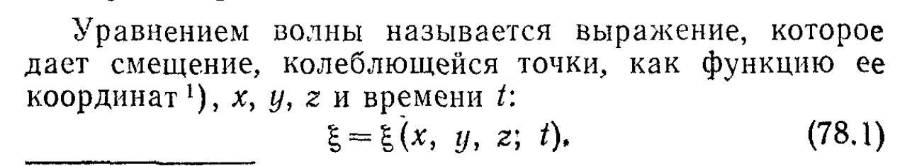

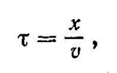

## Уравнение плоской волны

$$
\textbf{уравнеие плоской волны }
$$

$$ 
\xi = a\cos(wt-kx) 
$$

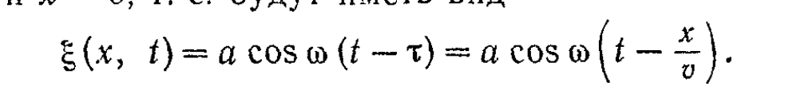

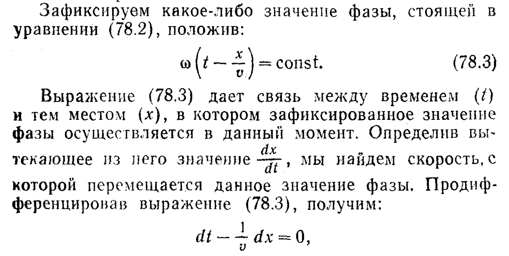

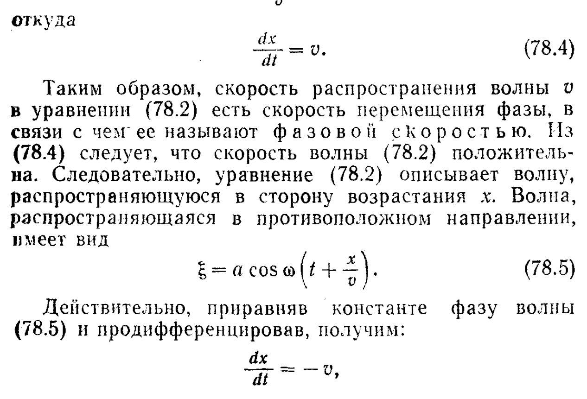

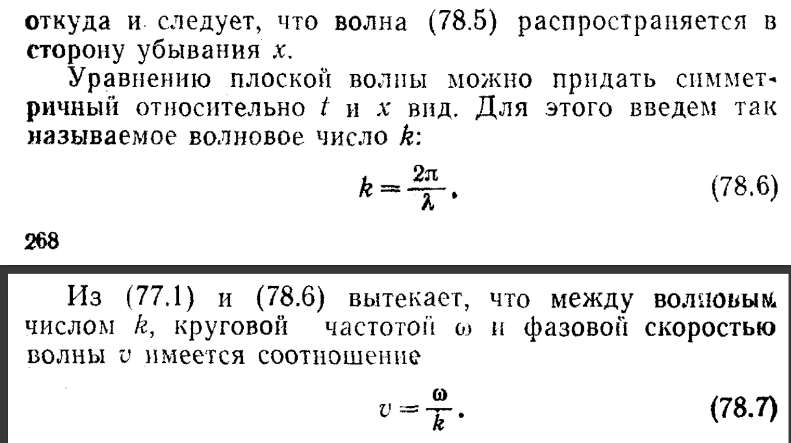

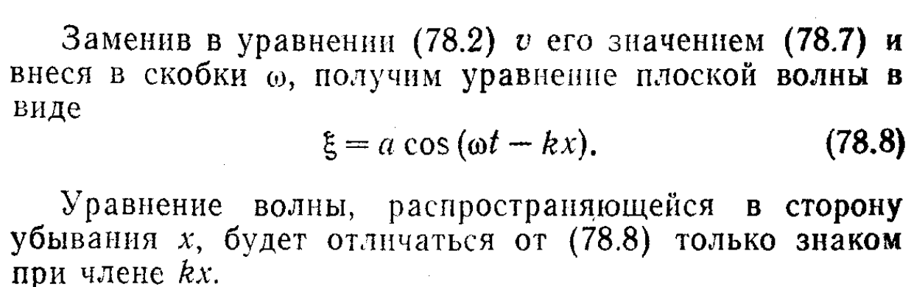

## Уравнение сферической волны

$$
\textbf{уравнение сферической волны}
$$

$$
\xi = \frac{a}{r}\cos w(t-\frac{r}{v})
$$

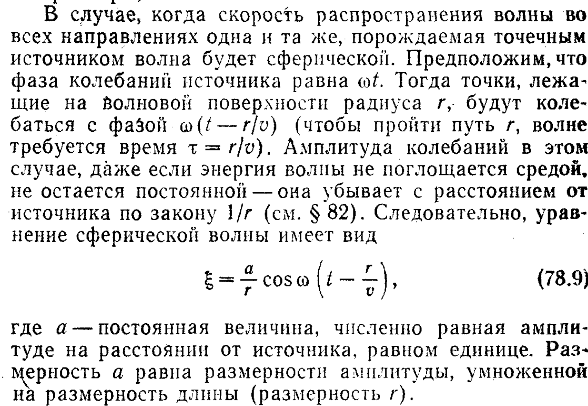

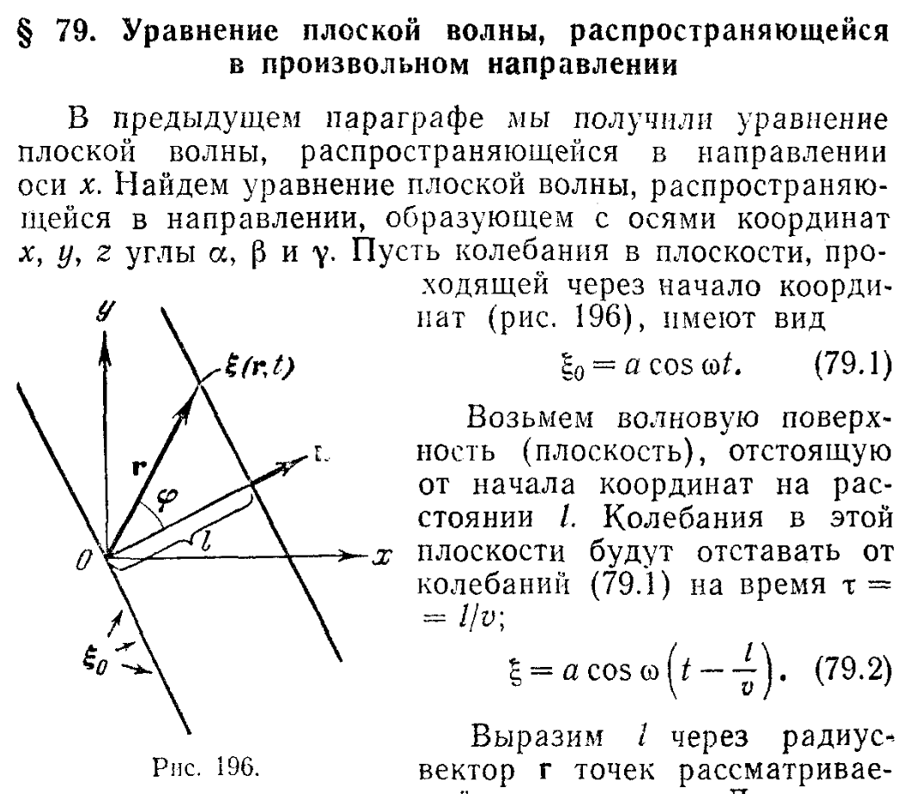

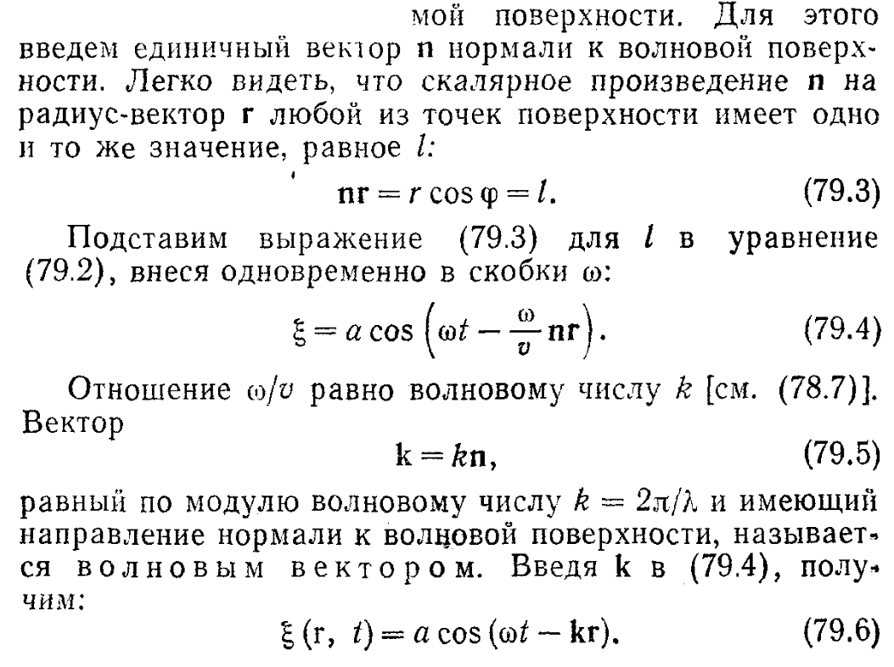

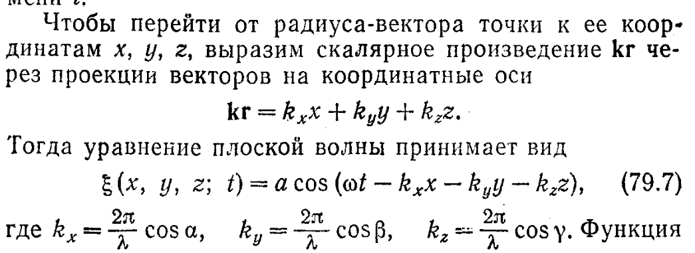

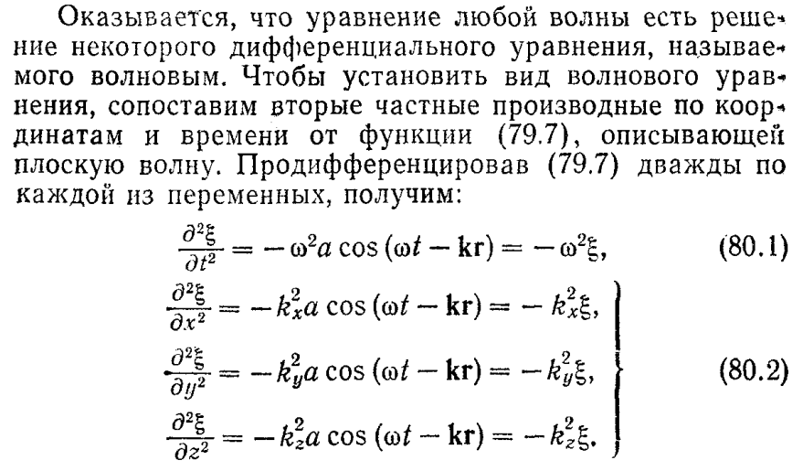

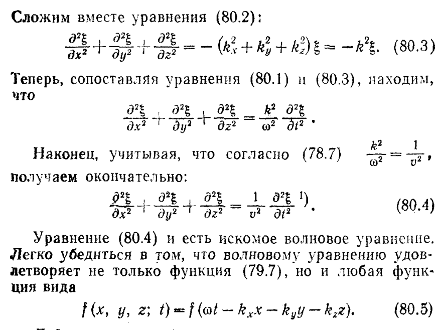