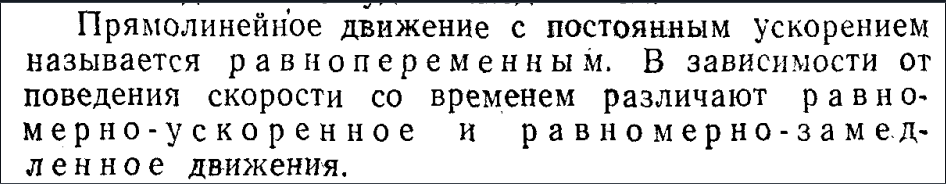

# Законы равномерного, равнопеременного, криволинейного движения

## 1. Равномерное криволинейное движение
Если \( V = V_0 = \text{const} \), то криволинейное движение называют **равномерным**

\[
\frac{dS}{dt} = v
\]
\[
dS = v \, dt
\]
\[
S = S_0 + v_0 t
\]

где \( S_0 \) - начальное движение точки  
\( S_0 = S(t_0) \).

**Тангенсальное ускорение** касательное.

## 2. Равнопеременное криволинейное движение
\( a_{\tau} = \text{const} \), где \( a \) - тангенсальное ускорение, то криволинейное движение **равнопеременное**.

\[
\frac{dv}{dt} = a_{\tau}
\]
\[
dv = a_{\tau} \, dt
\]
\[
v = v_0 + a_{\tau} t
\]
\[
v = \frac{dS}{dt}
\]
\[
S = S_0 + v_0 t + \frac{a_{\tau} t^2}{2}
\]

## Виды прямолинейного движения

### 1. Равномерное движение (`a = 0`):

* Скорость постоянна:
  $$
  v=const
  $$
* Уравнение движения:
  $$
  x(t)=x_0+v⋅t
  $$

### 2. Равнопеременное движение (`a = const`):

* Уравнение скорости:

  $$
  v(t)=v_0+a⋅t
  $$
* Уравнение движения:

  $$
  x(t)=x_0+v_0⋅t+\frac{a⋅t^2}{2}
  $$

