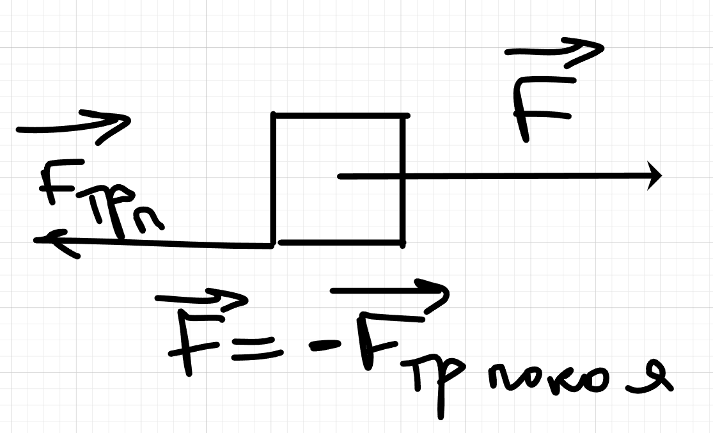

Всего есть 3 закона Ньютона:

# Первый закон ньютона: 
  
> *всякое тело находится в состоянии покоя или равномерного и прямолинейного движения, пока воздействие со стороны других тел не заставит его изменить это состояние*

Оба названных состояния отличаются тем, что ускорение тела равно 0. Поэтому в формулировке первого закона можно придать следующий вид:
  
> *Скорость любого тела остаётся постоянной (в частности, равной 0, пока воздействие на это тело со стороны других тел не вызовет её изменения)*
  
**Инерциальная система отсчёта** - система отсчета, в которой выполняется первый закон ньютона

# Второй закон ньютона

> *ускорение всякого тела прямопропорционально действующей на него силе и обратно пропорционально массе тела*

$$
F = m \cdot a
$$

**2ой закон ньютона работает только в инерциальных системах отсчета**

# Третий закон ньютона

> *всякое действие тел друг на друга носит характер взаимодействия; силы, с которыми действуют друг на друга взаимодействующие тела, всегда равны по величине и противоположны по направлению*

