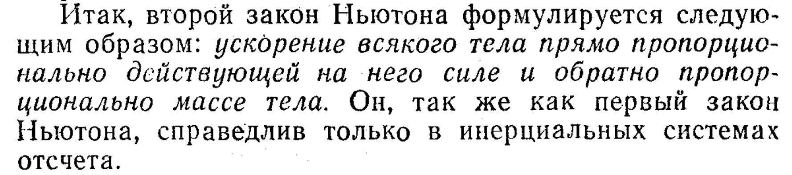
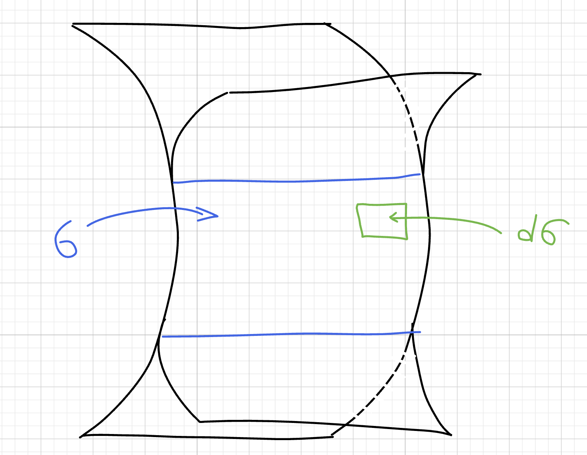
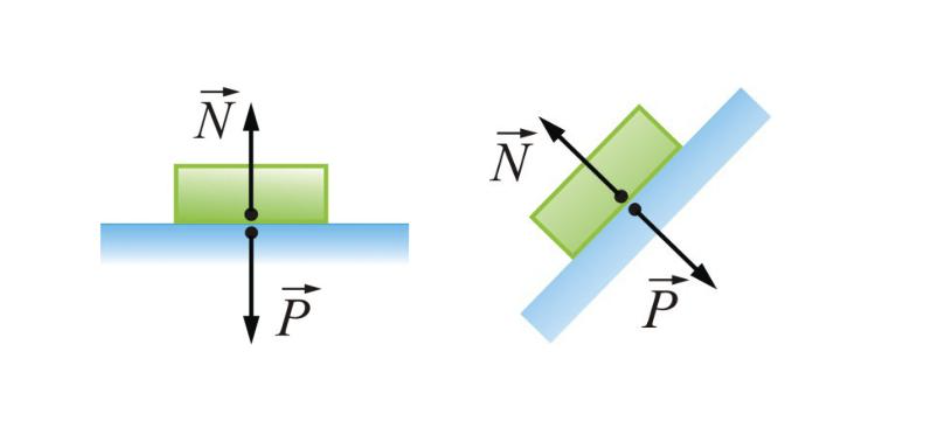
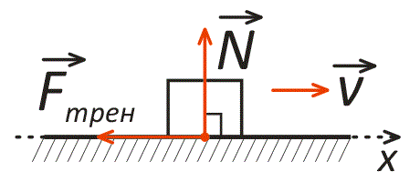

## Вес тела и сила

**ОПР**

$$
P=F_т = mg \ \ \ , \ \ \ \ где\ m-масса\ тела,\ g -ускорение\ свободного\ падения(на\ Земле\ 9,8 м/с²)
$$

нам понадобится масса из определения веса:

$$
m = \frac{P}{g}
$$

**Понятие силы ввел Ньютон во втором законе:**

**ОПР**

2ой закон Ньютона определяется так:

$$
\frac{a}{g}=\frac{F}{P} \Rightarrow F= \frac{P}{g}a = ma
$$

$$
где\ a-ускорение\ тела\ и\ F- сила (измеряется\ в\ Ньютонах \ , как \ и\ вес )
$$

**ЗАМЕЧАНИЕ**

$$
\frac{d(m·v)}{dt} = \frac{m·d(v)}{dt} =F
$$

$$
где\ m-масса,\ v-скорость
$$

## Силы

### Поверхностные силы

**ОПР**

**Напряжение** выражется так:

$$
P=\frac{dF}{d\sigma}
$$

$$
где\ F-сила,\ \sigma-площадь\ соприкосновения\ тел,\ d\sigma - площадь\ на\ которую\ действуют\ силы
$$

### Объемные(массовые) силы

Данные силы действуют на все тело целиком

**ОПР**

Напряженность выражается так

$$
f = \frac{dF}{d\tau}
$$

$$
где\ \tau-объём\ тела,\ F-действующая\ сила
$$

**ОПР**

Плотность тела выражается

$$
\rho=\frac{dm}{d\tau},\ где\ m-масса\ тела\ и\ \tau - объем\ тела
$$

**ЗАМЕЧАНИЕ**

$$
\frac{dF}{dm} = a \ \  \Rightarrow \ \ dF=d(m)·a=\rho·a·d(\tau) \ \ \Rightarrow\ \  f=\rho a
$$

### Сила реакции опоры

**ОПР**

Это сила, с которой **опора (поверхность) действует на тело**, препятствуя его проникновению внутрь. Она возникает как реакция на давление тела на опору и всегда направлена **перпендикулярно поверхности** (отсюда название «нормальная»).

$$
N=mg\ \ \ , если\ наклона
$$

$$
N=mg⋅cosθ \ \ \ , если\ есть\ наклон \ с \ углом \ θ
$$

### Сила трения

**ОПР**

Это сила, возникающая при **контакте двух тел** и препятствующая их **относительному движению** (или направленная против движения).

Выражается как

$$
F_{тр}=K·N
$$

$$
где\ K\ -это \ коэфицент\ трения,\ N-сила\ реакции\ опоры
$$

## Внешние силы

**ОПР**

Внешние силы - это силы, действующие на систему **со стороны объектов, не входящих в неё**.

**Пример**

Вы толкнули качелю(она состоит из элементов, которые взаимодействуют друг с другом) приложив некотурую силу, она начала качаться. Вы изменили состояние системы качели из вне.

## Внутрение силы

**ОПР**

Внутрение силы - это силы, с которыми **элементы системы взаимодействуют друг с другом**.

**Пример**

В качелях рама и балки, соединяющие сидушку, начинают испытывать силу трения.
