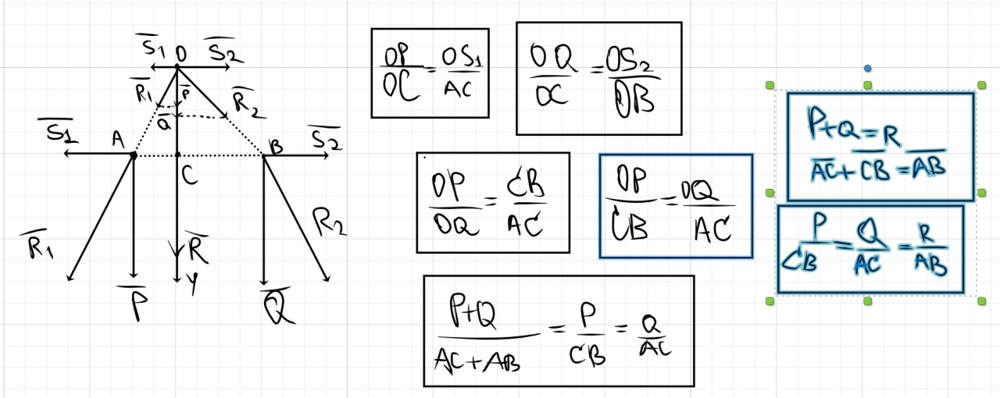

# Параллельные силы (системы двух параллельных сил)

Переместим $A$ и $B$ в одну точку, наречем ей имя $O$.

Как разложить результирующую силу $R$ на 2 параллельные:

$$R = P + Q; \ \ Q = R - P$$

$$\dfrac{P}{CB} = \dfrac{Q}{AC}; \ \ CB = AC \cdot \dfrac{P}{Q}$$

$$\overrightarrow{P} \cdot AC = \overrightarrow{Q} \cdot CB$$

  
$r_0 - ?$, $r_1,\, r_2$ знаем.

$$\overrightarrow{r_1} + \overrightarrow{AC} = \overrightarrow{r_0}$$

$$\overrightarrow{r_0} + \overrightarrow{CB} = \overrightarrow{r_2}$$

$$\overrightarrow{AC} = \overrightarrow{r_0} - \overrightarrow{r_1}$$

$$\overrightarrow{CB} = \overrightarrow{r_2} - \overrightarrow{r_0}$$

$$\dfrac{\overrightarrow{AC}}{P_2} =\dfrac{\overrightarrow{CB}}{P_1} \ \ \text{(соотношение плеч и сил)}$$

$$\dfrac{\overrightarrow{r_0 - r_1}}{P_2} = \dfrac{\overrightarrow{r_2 - r_0}}{P_1} \Rightarrow \dfrac{P_1\overrightarrow{r_1} + P_2\overrightarrow{r_2}}{P_1 + P_2} \Rightarrow$$ нашли $C$.

Для $n$ векторов: 
$$\overrightarrow{r_0} = \dfrac{\sum\limits_{i=1}^{n} P_i r_i}{\sum\limits_{i=1}^{n} P_i}$$
