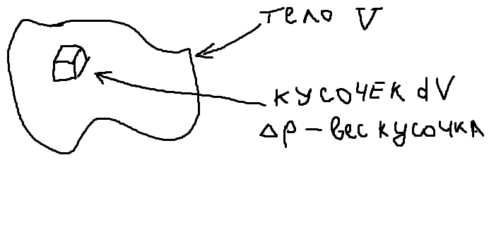

## Центр тяжести

\[
\gamma = \lim_{\Delta v \to 0} \left( \frac{\Delta P}{\Delta v} \right) = \frac{dP}{dv} \text{ - Вес на единицу объема.}
\]

\[
\rho = \frac{\gamma}{g}, \quad \Delta P_i = \gamma_i \Delta V_i = g_i \cdot \rho_i \cdot \Delta v_i
\]

\[
\vec{r_0} = \frac{\sum_{i=1}^n (P_i \cdot \vec{r_i})}{\sum_{i=1}^n P_i} = \frac{\sum_{i=1}^n (\gamma_i \cdot \Delta v_i \cdot \vec{r_i})}{\sum_{i=1}^n (\gamma_i \cdot \Delta v_i)}
\]

\[
\gamma_i = \rho_i \cdot g_i; \quad \vec{r_0} = \frac{\sum_{i=1}^n (\rho_i \cdot g_i \cdot \Delta v_i \cdot \vec{r_i})}{\sum_{i=1}^n (\rho_i \cdot g_i \cdot \Delta v_i)}
\]

Если тело мало, то \( g_i = \text{const} \) по \( V_i \), тогда:

\[
\vec{r_0} = \frac{\sum_{i=1}^n (\rho_i \cdot \Delta v_i \cdot \vec{r_i})}{\sum_{i=1}^n (\rho_i \cdot \Delta v_i)} \text{ - радиус-вектор центра масс тяжести,}
\]

где \( \sum_{i=1}^n (\rho_i \cdot \Delta v_i) \) - масса тяжести.

Если \( \gamma_i, \rho \) - непрерывные функции для всех точек тела, то \( \Rightarrow \rho_i \) - одинаково для всех слагаемых.

\[
r_0 \equiv \frac{\int_V \rho \cdot \vec{r} \cdot dv}{\int_V \rho \cdot dv}

1. **Физический смысл**:
   - Центр тяжести - точка приложения равнодействующей сил тяжести
   - Для однородного тела совпадает с центром масс

